```{=openxml}
<w:p><w:pPr><w:jc w:val="center"/><w:spacing w:before="2300" w:after="120" w:line="360" w:lineRule="auto"/></w:pPr><w:r><w:rPr><w:b/><w:sz w:val="36"/><w:szCs w:val="36"/></w:rPr><w:t xml:space="preserve">Análisis controlado de vulnerabilidades en un servicio FTP mediante Kali Linux y virtualización</w:t></w:r></w:p><w:p><w:pPr><w:jc w:val="center"/><w:spacing w:before="0" w:after="0" w:line="360" w:lineRule="auto"/></w:pPr><w:r><w:rPr><w:b/><w:sz w:val="32"/><w:szCs w:val="32"/></w:rPr><w:t xml:space="preserve">Informe de Laboratorio N.° 1</w:t></w:r></w:p><w:p><w:pPr><w:jc w:val="center"/><w:spacing w:before="1500" w:after="0" w:line="320" w:lineRule="auto"/></w:pPr><w:r><w:rPr><w:b/><w:sz w:val="26"/><w:szCs w:val="26"/></w:rPr><w:t xml:space="preserve">Sebastián López Osorno</w:t></w:r></w:p><w:p><w:pPr><w:jc w:val="center"/><w:spacing w:before="120" w:after="0" w:line="320" w:lineRule="auto"/></w:pPr><w:r><w:rPr><w:sz w:val="24"/><w:szCs w:val="24"/></w:rPr><w:t xml:space="preserve">Politécnico Colombiano Jaime Isaza Cadavid</w:t></w:r></w:p><w:p><w:pPr><w:jc w:val="center"/><w:spacing w:before="0" w:after="0" w:line="320" w:lineRule="auto"/></w:pPr><w:r><w:rPr><w:sz w:val="24"/><w:szCs w:val="24"/></w:rPr><w:t xml:space="preserve">Facultad de Ingenierías — Departamento de Informática</w:t></w:r></w:p><w:p><w:pPr><w:jc w:val="center"/><w:spacing w:before="0" w:after="0" w:line="320" w:lineRule="auto"/></w:pPr><w:r><w:rPr><w:sz w:val="24"/><w:szCs w:val="24"/></w:rPr><w:t xml:space="preserve">Diplomado en Ciberseguridad Informática</w:t></w:r></w:p><w:p><w:pPr><w:jc w:val="center"/><w:spacing w:before="0" w:after="0" w:line="320" w:lineRule="auto"/></w:pPr><w:r><w:rPr><w:sz w:val="24"/><w:szCs w:val="24"/></w:rPr><w:t xml:space="preserve">Docente: Edwin Andrés Ochoa Agudelo</w:t></w:r></w:p><w:p><w:pPr><w:jc w:val="center"/><w:spacing w:before="1000" w:after="0" w:line="320" w:lineRule="auto"/></w:pPr><w:r><w:rPr><w:sz w:val="24"/><w:szCs w:val="24"/></w:rPr><w:t xml:space="preserve">25 de septiembre de 2026</w:t></w:r></w:p><w:p><w:pPr><w:spacing w:after="0"/><w:rPr><w:sz w:val="2"/></w:rPr></w:pPr><w:r><w:br w:type="page"/></w:r></w:p>
```

# Resumen

El presente informe documenta el desarrollo del Laboratorio N.° 1 del Diplomado en Ciberseguridad
Informática, cuyo propósito fue montar un entorno de análisis controlado con Kali Linux sobre una
plataforma de virtualización, desplegar de forma aislada la máquina vulnerable **"FirstHacking"** de
la plataforma DockerLabs y ejecutar el ciclo completo de una evaluación de seguridad: preparación
del entorno, reconocimiento, enumeración de servicios, investigación de la vulnerabilidad,
validación controlada mediante una prueba de concepto y un análisis complementario de tráfico de
red. Todas las actividades se realizaron sobre un objetivo autorizado (un contenedor Docker con la
dirección interna `172.17.0.2`), sin salir en ningún momento de la red aislada del laboratorio.

Durante el reconocimiento se identificó un único puerto expuesto, `21/tcp`, ejecutando el servicio
**vsftpd 2.3.4**. La investigación en fuentes reconocidas relacionó esa versión con la
vulnerabilidad **CVE-2011-2523** (puerta trasera de vsftpd 2.3.4). Mediante una prueba de concepto
pública se reprodujo la condición vulnerable de forma controlada, obteniendo una sesión de comandos
con privilegios de **root** dentro del contenedor objetivo. Finalmente, como valor agregado, se
realizó un análisis de tráfico con `tcpdump` que evidenció la transmisión de información **en texto
plano**, demostrando de forma empírica el riesgo de emplear protocolos sin cifrado.

El informe relata además, como parte de la metodología de resolución de problemas, dos incidencias
técnicas reales: la ruptura del sistema Kali Linux 2025.2 tras una actualización de paquetes —que
obligó a migrar a Kali Linux 2026.2— y un error de permisos en el script de despliegue. Ambas se
documentan porque forman parte del razonamiento técnico y refuerzan el valor de la virtualización
como entorno recuperable y repetible.

# 1. Introducción y objetivos

La ciberseguridad ofensiva controlada parte de una premisa sencilla: para defender un sistema hay
que comprender cómo se ataca. Kali Linux, ejecutado sobre una plataforma de virtualización,
constituye el entorno idóneo para ese aprendizaje, ya que combina un conjunto maduro de herramientas
de auditoría con las garantías que aporta la virtualización: **aislamiento** respecto a la máquina
física, **repetibilidad** del escenario y **capacidad de recuperación** ante cualquier fallo. Gracias
a ello es posible reproducir un ataque real sin poner en riesgo infraestructura productiva.

**Objetivo general.** Desarrollar un laboratorio controlado con Kali Linux para reconocer una máquina
vulnerable, identificar los servicios expuestos, consultar vulnerabilidades conocidas y validar de
manera autorizada una condición vulnerable, analizando en el proceso las capacidades de la
virtualización.

**Objetivos específicos.**

1. Preparar y configurar de forma segura el entorno virtual de análisis.
2. Desplegar la máquina vulnerable de forma aislada e identificar su dirección interna.
3. Realizar reconocimiento y enumeración de servicios con Nmap, interpretando cada parámetro.
4. Investigar la vulnerabilidad asociada al servicio y su versión (CVE, impacto y condiciones).
5. Validar de forma controlada la explotación mediante una prueba de concepto.
6. Analizar el riesgo, proponer controles de mitigación y documentar técnicamente todo el proceso.

# 2. Condiciones de seguridad

La práctica se ejecutó respetando estrictamente las condiciones establecidas para un laboratorio
controlado:

- Las pruebas se realizaron **únicamente** sobre la máquina vulnerable autorizada para la actividad.
- El objetivo se mantuvo **aislado** en la red interna de Docker (`172.17.0.0/16`), sin exposición a
  redes institucionales, productivas ni de terceros.
- No se emplearon direcciones IP públicas ni sistemas ajenos al laboratorio.
- No se realizó persistencia, movimiento lateral ni acceso a otros sistemas.
- La prueba se detuvo una vez obtenida evidencia suficiente del objetivo académico.

Estas condiciones no son un formalismo: delimitan el alcance ético y legal del ejercicio y garantizan
que una actividad ofensiva se mantenga como una práctica de aprendizaje y no como una amenaza real.

# 3. Entorno virtual y preparación

El laboratorio se montó sobre **VMware Workstation Pro 17**, un hipervisor de tipo 2 que permite
ejecutar varios sistemas operativos huésped de forma simultánea y aislada. El sistema atacante fue
**Kali Linux**, comunicado con el objetivo a través de la red interna que gestiona Docker. El
objetivo, en cambio, se ejecuta como **contenedor**, de modo que en el mismo escenario conviven las
dos grandes tecnologías de aislamiento —máquina virtual y contenedor—, cuya diferencia se analiza en
la sección 13.

**Descripción del entorno y de la red.** El escenario quedó configurado de la siguiente manera:

| Componente | Detalle |
|:---|:---|
| Hipervisor | VMware Workstation Pro 17 |
| Sistema atacante | Kali Linux 2026.2 (máquina virtual) |
| Recursos de la máquina virtual | 8 GB de RAM, 8 procesadores y disco de 100 GB |
| Objetivo | Contenedor Docker "FirstHacking" |
| Segmento de red aislada | Red interna de Docker `172.17.0.0/16` |
| Dirección IP del objetivo | `172.17.0.2` |
| Puerta de enlace / interfaz de Kali | `172.17.0.1` / `192.168.5.136` |

La comunicación entre Kali y el objetivo se mantuvo dentro de este segmento aislado, sin exposición a la red institucional ni a terceros.

## 3.1 Despliegue inicial del objetivo

Se utilizó la plataforma **DockerLabs** para descargar y desplegar la máquina vulnerable
"FirstHacking". El script de despliegue construye el contenedor a partir de una imagen y le asigna
automáticamente una dirección en la red interna de Docker; en este caso, la dirección **`172.17.0.2`**,
que constituye el objetivo autorizado durante todo el ejercicio.

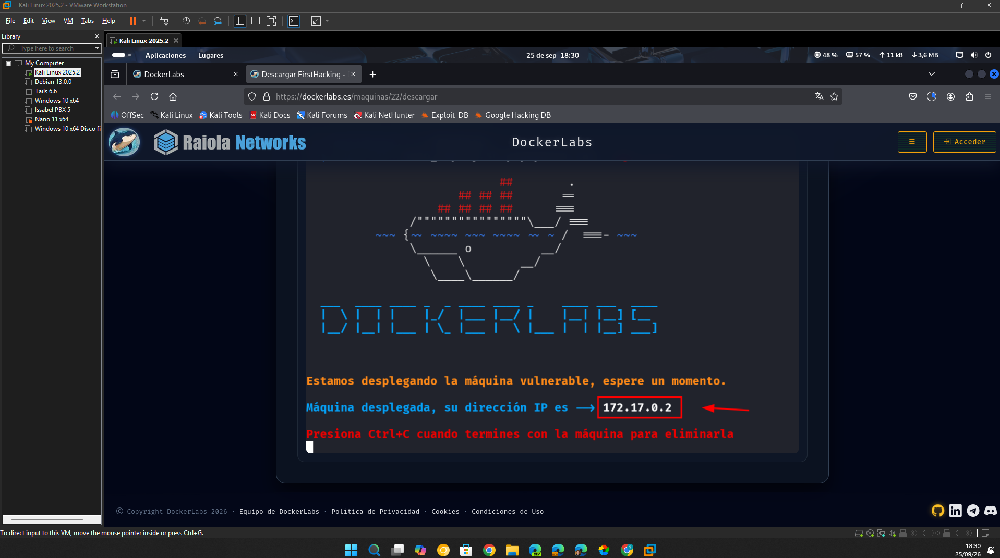{ width=6.1in }

*Figura 1.* Plataforma DockerLabs con la máquina "FirstHacking" desplegada; se resalta la dirección IP interna asignada al objetivo, `172.17.0.2`.

## 3.2 Incidencia técnica: actualización y ruptura de Kali 2025.2

Como parte del mantenimiento inicial se ejecutó una actualización completa del sistema
(`apt update && apt upgrade`) sobre **Kali Linux 2025.2**. Durante el proceso se descargaron y
desempaquetaron paquetes de base del sistema (entre ellos `libc6`, `locales` y componentes de
`texlive`).

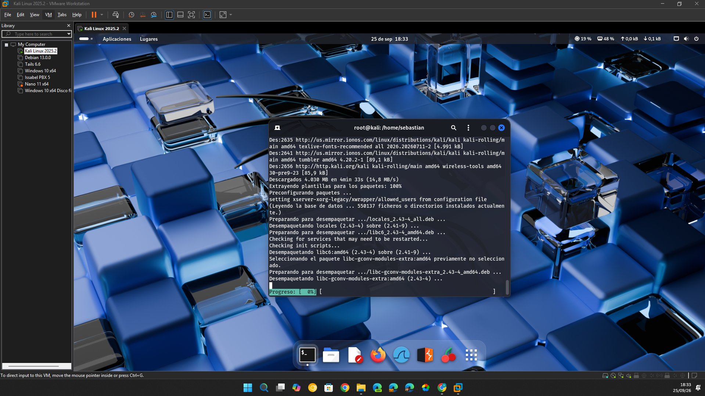{ width=6.1in }

*Figura 2.* Proceso de actualización de paquetes en Kali Linux 2025.2.

Al reiniciar, el sistema quedó **inservible**: se detenía de forma reiterada en la fase de arranque,
mostrando el mensaje `piix4_smbus 0000:00:07.3: SMBus Host Controller not enabled!` sin completar la
carga del entorno gráfico. Se trató de un conflicto de versiones introducido por la actualización,
que dejó el sistema en un estado no arrancable.

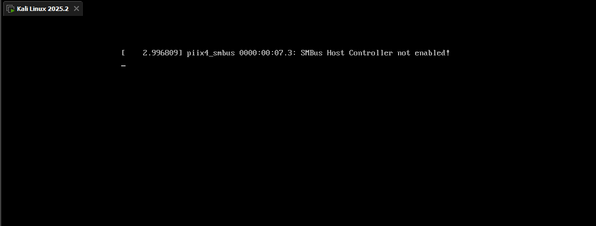{ width=6.1in }

*Figura 3.* Cuelgue en el arranque de Kali Linux 2025.2 tras la actualización de paquetes.

**Resolución (troubleshooting).** Dado que recuperar el entorno dañado habría consumido un tiempo
incompatible con el desarrollo de la clase, se optó por la solución más rápida y reproducible que
ofrece la virtualización: **reinstalar Kali Linux desde la imagen ISO 2026.2**. Esta decisión ilustra
en la práctica dos ventajas clave de trabajar sobre máquinas virtuales —la recuperación y la
repetibilidad—, que permitieron continuar el laboratorio sin afectar el equipo anfitrión ni perder el
objetivo de aprendizaje. Como buena práctica se recomienda, además, tomar una instantánea (*snapshot*) del entorno antes de iniciar las pruebas; en esta práctica la reinstalación desde la ISO cumplió esa misma función de recuperación, devolviendo el sistema a un estado limpio y operativo.

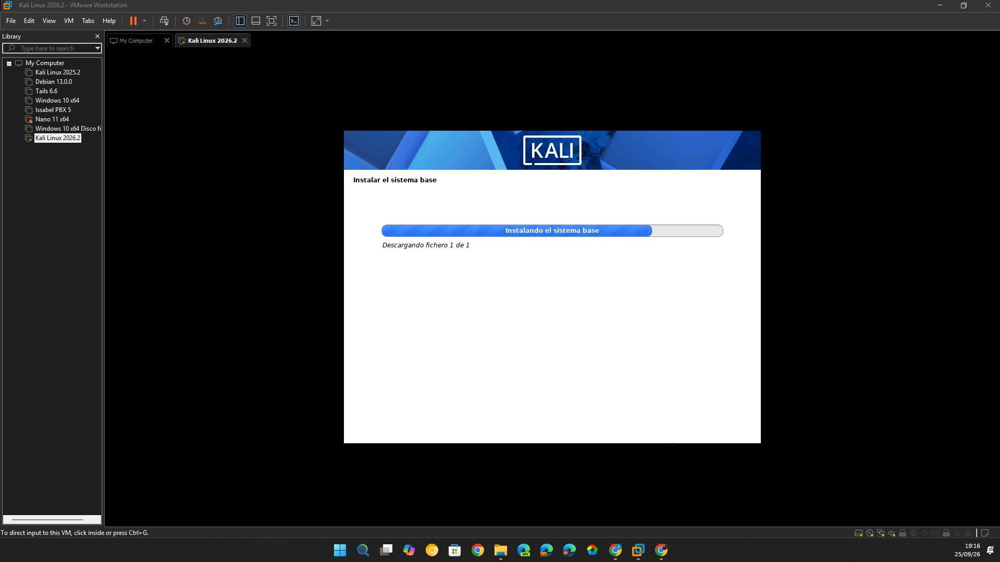{ width=6.1in }

*Figura 4.* Instalación del sistema base de Kali Linux 2026.2 desde la imagen ISO.

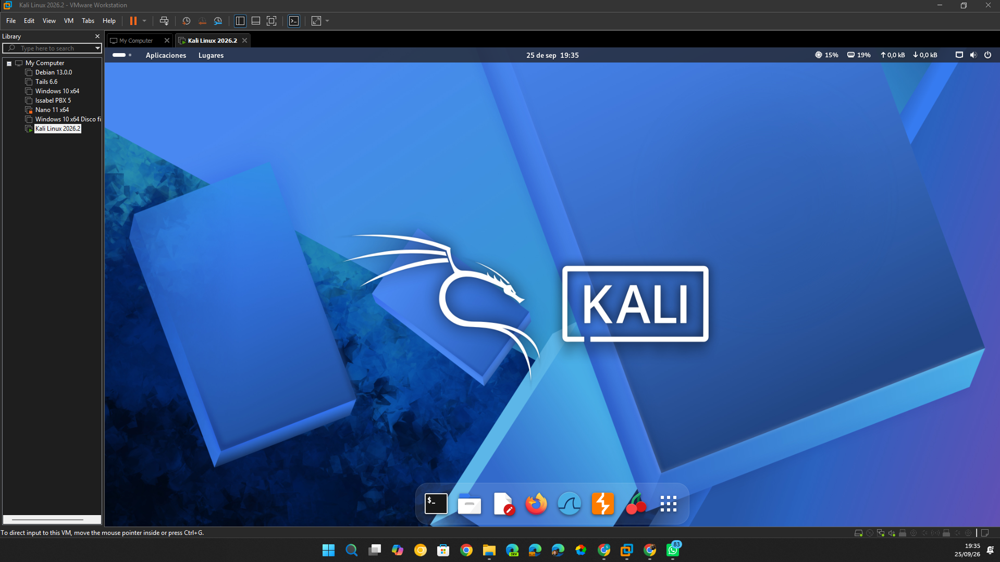{ width=6.1in }

*Figura 5.* Entorno de Kali Linux 2026.2 operativo tras la migración.

## 3.3 Recursos de la máquina virtual e instantánea de seguridad

Se verificaron los recursos asignados a la máquina virtual y, como buena práctica del laboratorio, se tomó una **instantánea (*snapshot*)** del entorno **antes de iniciar las pruebas**. La instantánea permite restaurar el sistema a un estado limpio y conocido en cualquier momento, lo que garantiza la repetibilidad del escenario y la recuperación ante cualquier alteración.

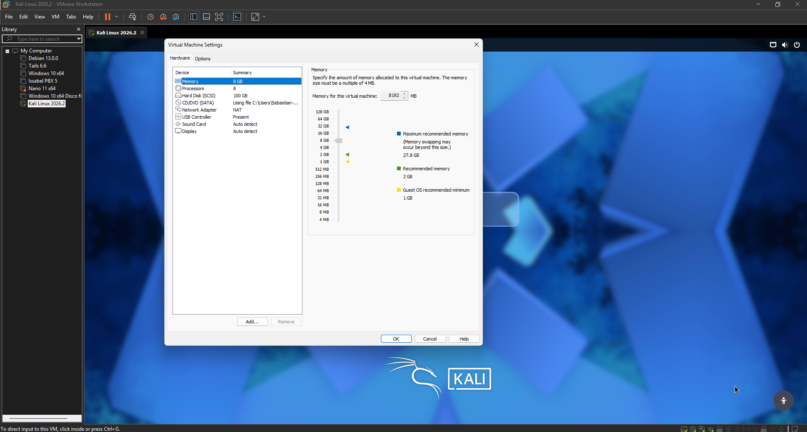{ width=6.1in }

*Figura 6.* Recursos asignados a la máquina virtual: 8 GB de memoria RAM, 8 procesadores, disco de 100 GB y adaptador de red.

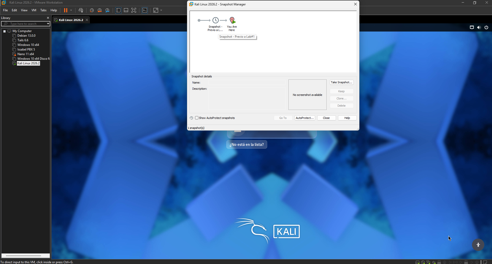{ width=6.1in }

*Figura 7.* Instantánea del entorno tomada antes de las pruebas: «Snapshot – Previo a Lab#1».

# 4. Despliegue de la máquina vulnerable

## 4.1 Exploración del paquete descargado

El objetivo se distribuye como un archivo comprimido `firsthacking.zip`. Antes de ejecutar nada se
inspeccionó el paquete —una buena práctica de seguridad frente a cualquier archivo descargado—
verificando su naturaleza con el comando `file` y comprobando la herramienta de descompresión
disponible.

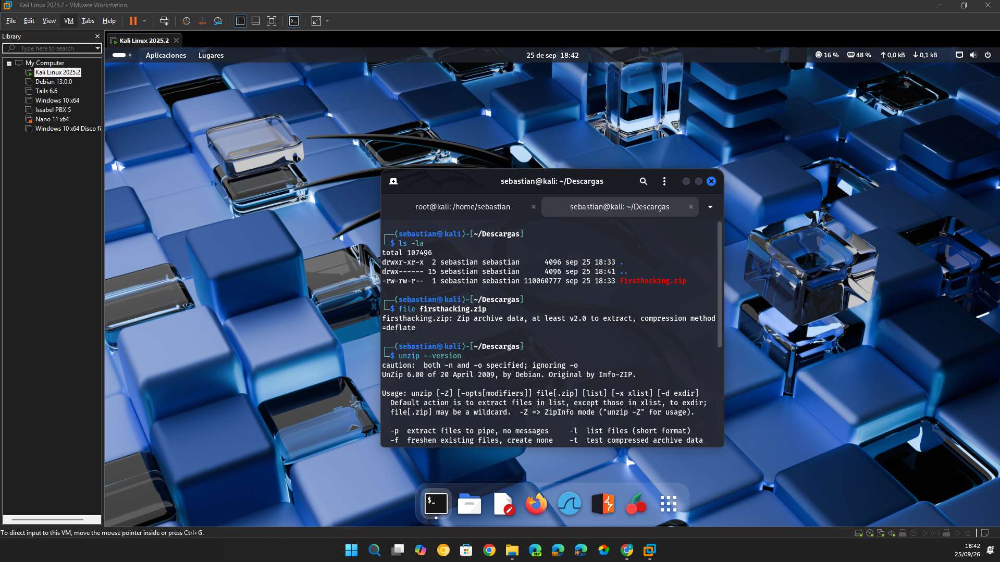{ width=6.1in }

*Figura 8.* Identificación del archivo con `file firsthacking.zip` (Zip archive data) y verificación de `unzip`.

Al descomprimir, el paquete reveló tres elementos: el script de despliegue `auto_deploy.sh`, la
imagen del contenedor `firsthacking.tar` (≈ 273 MB) y el propio `.zip`. El script es el orquestador
que importa la imagen a Docker y levanta el contenedor.

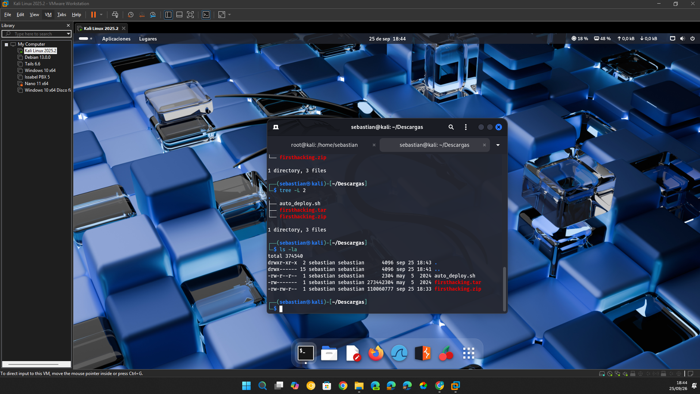{ width=6.1in }

*Figura 9.* Estructura del paquete: `auto_deploy.sh`, `firsthacking.tar` y `firsthacking.zip`.

## 4.2 Troubleshooting de permisos y privilegios

El script `auto_deploy.sh` carecía de permiso de ejecución. Se asignó con `chmod 755` y, al
ejecutarlo sin argumentos, el propio script indicó su modo de uso (`Uso: ./auto_deploy.sh
<archivo_tar>`), lo que confirmó que esperaba recibir la imagen `.tar` como parámetro.

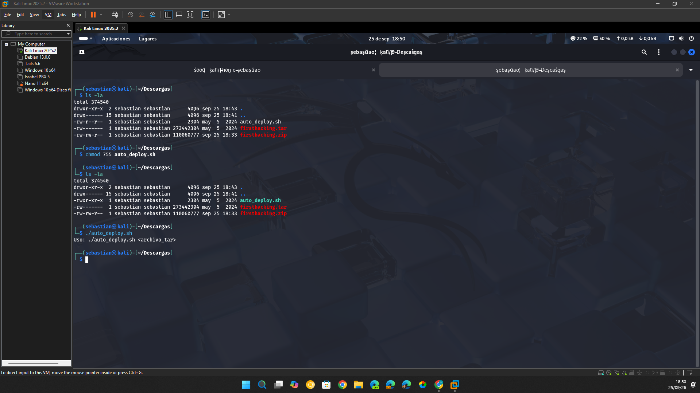{ width=6.1in }

*Figura 10.* Asignación de permisos con `chmod 755 auto_deploy.sh` y mensaje de uso del script.

La documentación oficial de la plataforma confirma que el despliegue requiere **privilegios
elevados**, ejecutándose como `sudo bash auto_deploy.sh <archivo>.tar`, ya que el script necesita
gestionar el motor Docker (importar la imagen, crear la red y levantar el contenedor), operaciones
reservadas al superusuario.

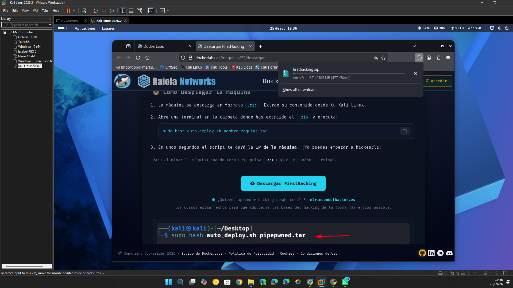{ width=6.1in }

*Figura 11.* Instrucciones oficiales de despliegue, que indican el uso de `sudo`.

Ya sobre Kali 2026.2 se repitió el procedimiento de forma limpia: descompresión y asignación de
permisos.

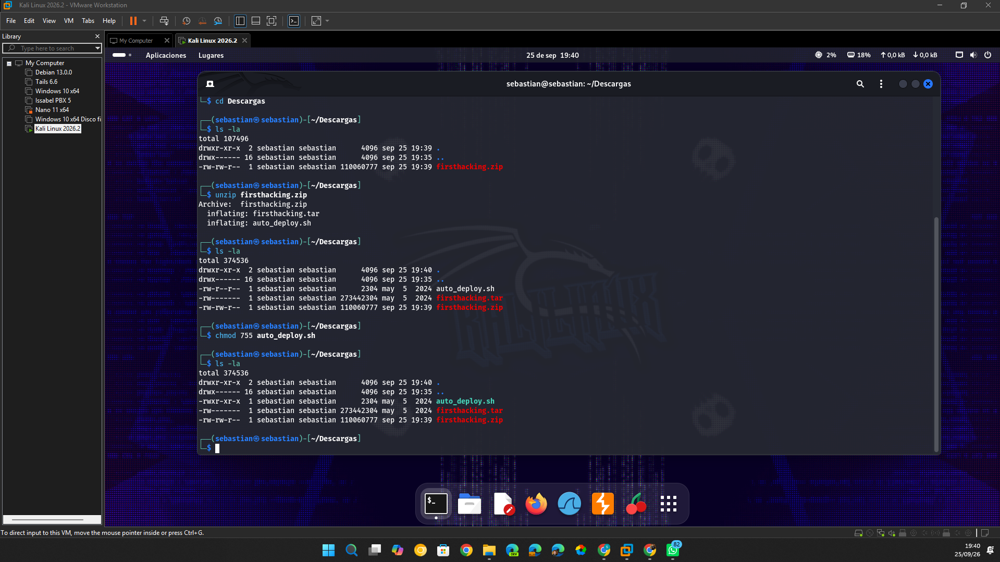{ width=6.1in }

*Figura 12.* Descompresión de `firsthacking.zip` y asignación de permisos en Kali Linux 2026.2.

Ejecutado con privilegios, el despliegue desencadenó la **instalación de Docker** y sus dependencias
(`docker.io`, `containerd`, `runc`, `docker-cli`, entre otras), tras lo cual el contenedor objetivo
quedó activo en `172.17.0.2`.

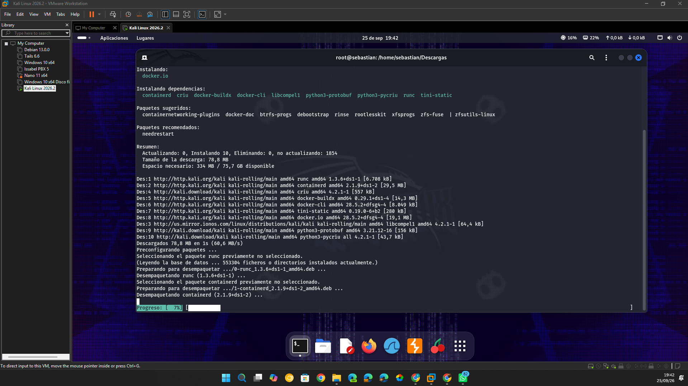{ width=6.1in }

*Figura 13.* Instalación de Docker y dependencias requeridas por el script de despliegue.

# 5. Reconocimiento inicial

Con el objetivo activo se inició la fase de reconocimiento, cuyo fin es descubrir qué servicios
expone la máquina. Esta etapa también dejó registro, como parte de la metodología de resolución de
problemas, de varios **errores de sintaxis** cometidos y corregidos durante el uso de Nmap (por
ejemplo `nmap -Ss` en lugar de `-sS`, o la orden inexistente `map`), así como del aviso
`Host seems down ... try -Pn`, que orientó el ajuste de los parámetros del escaneo. Documentar estos
tanteos refleja el proceso real de aprendizaje de la herramienta.

**Comprobación de conectividad.** Como el objetivo bloquea las sondas ICMP (ping), la conectividad se validó por la misma vía que Nmap emplea en la red local: la respuesta ARP del host (`Host is up, received arp-response`, visible en el escaneo de la Figura 16), que confirma que el objetivo está activo antes de proseguir.

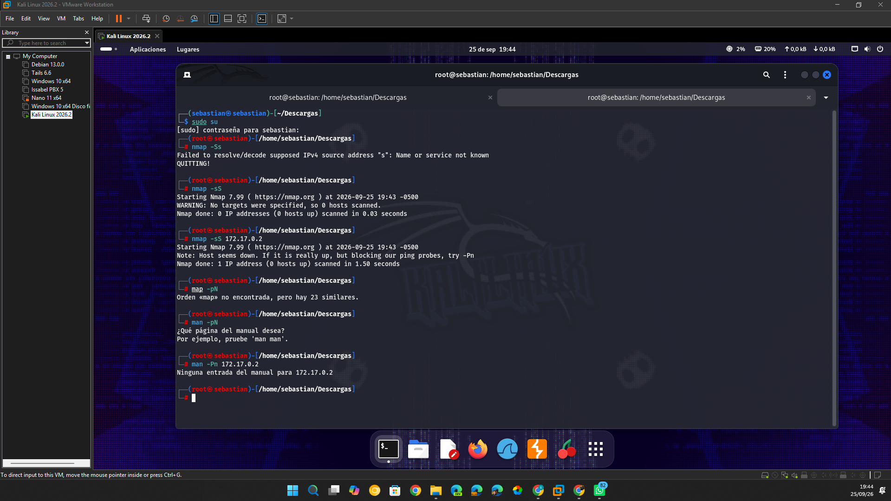{ width=6.1in }

*Figura 14.* Intentos iniciales de escaneo con Nmap y corrección de errores de sintaxis; el objetivo aparece como "caído" hasta ajustar los parámetros.

# 6. Escaneo y enumeración con Nmap

Se ejecutó un escaneo exhaustivo de los 65 535 puertos TCP, deshabilitando el descubrimiento por ping
(`-Pn`) —porque el objetivo bloqueaba las sondas ICMP— y guardando la salida en un fichero (`-oN`):

```bash
nmap -sS -Pn -n -vvv -p- --min-rate=5000 -oN primer_escaneo 172.17.0.2
```

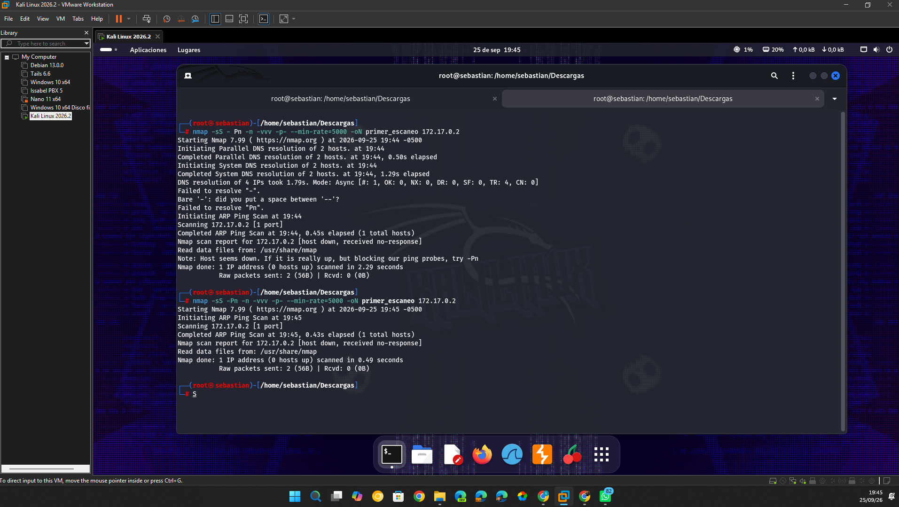{ width=6.1in }

*Figura 15.* Escaneo completo de puertos con Nmap sobre `172.17.0.2`.

**Interpretación de los parámetros empleados:**

| Parámetro | Función |
|:---|:---|
| `-sS` | Escaneo TCP SYN ("half-open"): rápido y discreto; no completa el saludo de tres vías. |
| `-Pn` | Omite el descubrimiento por ping y trata al host como activo (necesario porque bloquea ICMP). |
| `-p-` | Escanea el rango completo de puertos (1–65535). |
| `-sV` | Detección de servicio y **versión** sobre los puertos abiertos. |
| `-n` | Evita la resolución DNS, lo que acelera el escaneo. |
| `--min-rate=5000` | Fuerza un mínimo de 5000 paquetes por segundo (rendimiento). |
| `-oN` | Guarda la salida en formato normal en el fichero indicado. |

Añadiendo `-sV` se identificó, sobre el único puerto abierto, el servicio y su versión exacta:

```
PORT   STATE SERVICE REASON        VERSION
21/tcp open  ftp     syn-ack ttl 64 vsftpd 2.3.4
Service Info: OS: Unix
```

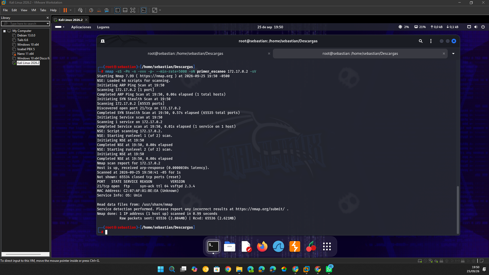{ width=6.1in }

*Figura 16.* Detección de versión con `-sV`: puerto `21/tcp` abierto ejecutando **vsftpd 2.3.4**.

**Resultado del reconocimiento.** De 65 535 puertos, solo `21/tcp` está abierto, ejecutando el
servicio FTP **vsftpd 2.3.4** sobre un sistema Unix. Un servicio FTP de una versión antigua y
concreta constituye una **superficie de ataque** de manual: expone un punto de entrada, revela la
versión exacta del software —lo que facilita la búsqueda de exploits dirigidos— y emplea un protocolo
que transmite sin cifrado. La combinación de estos tres factores convierte a este único puerto en el
foco de todo el análisis posterior.

**Comparación de los escaneos.** El reconocimiento siguió una progresión de menor a mayor detalle: un primer escaneo general para descubrir los puertos abiertos, un escaneo TCP SYN (`-sS`) dirigido para confirmar el estado del puerto y, por último, un escaneo de versión (`-sV`) para identificar el software exacto. La comparación es reveladora: los dos primeros indican *qué* puerto está abierto, pero solo el tercero aporta el dato decisivo —la versión **vsftpd 2.3.4**—, que es precisamente lo que habilita la búsqueda de la vulnerabilidad concreta.

# 7. Investigación de la vulnerabilidad

## 7.1 Identificación de la vulnerabilidad

La versión **vsftpd 2.3.4** es conocida por contener una **puerta trasera (backdoor)** que fue
introducida maliciosamente en el código fuente del proyecto durante un compromiso de su servidor de
distribución. La vulnerabilidad está catalogada como **CVE-2011-2523**. Esta correspondencia entre la versión detectada y el identificador se contrastó en la Base de Datos Nacional de Vulnerabilidades (NVD/NIST) y en MITRE, fuentes de referencia en la gestión de vulnerabilidades.

- **Descripción.** El código comprometido abre una puerta trasera: cuando el nombre de usuario
  enviado en el login FTP contiene la secuencia `:)` (una "carita sonriente"), el servicio abre un
  intérprete de comandos vinculado al puerto **`6200/tcp`**.
- **Impacto.** Ejecución remota de comandos con privilegios de **root**, es decir, el compromiso
  total del sistema afectado (confidencialidad, integridad y disponibilidad).
- **Condiciones.** El servicio vulnerable debe ser accesible por red; no se requiere una
  autenticación válida, porque el disparador es la propia cadena del nombre de usuario.
- **Corrección.** El proyecto retiró el código malicioso poco después de detectarlo; las versiones
  posteriores (la rama 2.3.x corregida y toda la **serie 3.x**) no contienen la puerta trasera. La
  mitigación efectiva, por tanto, es actualizar a una versión soportada del servidor FTP.

## 7.2 Búsqueda de referencias de explotación

Se localizó una prueba de concepto pública mediante Searchsploit / Exploit-DB, obteniéndose el script
en Python **`49757.py`** (Exploit-DB, EDB-ID 49757). Antes de ejecutarlo se verificó su modo de uso y
el intérprete disponible (`Python 3.13.12`), confirmando que el script requiere la dirección del
objetivo como argumento.

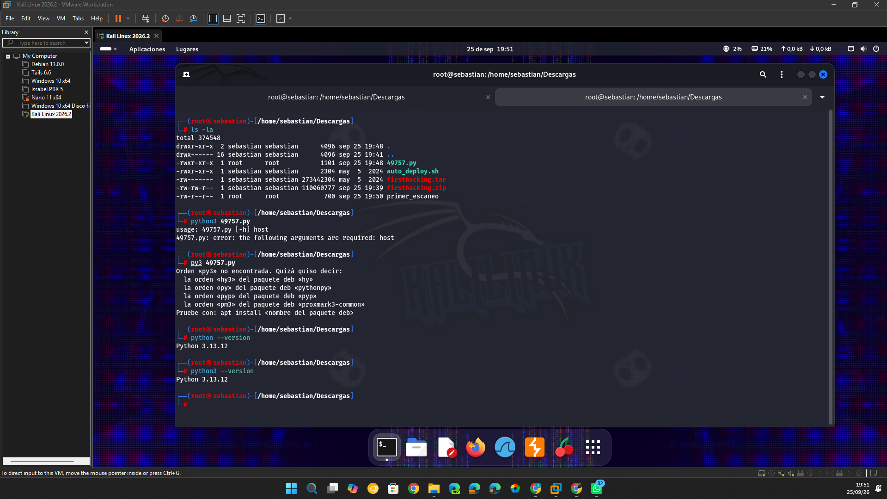{ width=6.1in }

*Figura 17.* Prueba de concepto `49757.py` en el directorio de trabajo y verificación del intérprete Python.

La revisión de la cabecera del script confirma su asociación con **CVE-2011-2523** y documenta su
mecanismo: se conecta al FTP (puerto 21), envía un nombre de usuario que incluye el disparador `:)` y,
acto seguido, se conecta al puerto **6200**, donde el propio servidor ha abierto un intérprete de
comandos. *(Con criterio de buenas prácticas, este informe describe el mecanismo con fines académicos
y muestra la evidencia, sin reproducir el código completo del exploit.)*

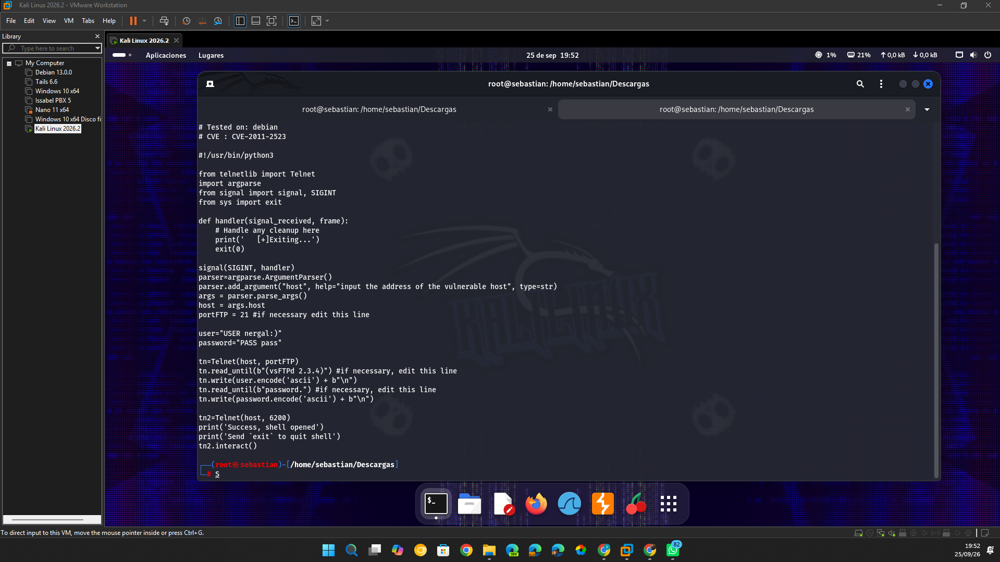{ width=6.1in }

*Figura 18.* Cabecera y lógica de la prueba de concepto, con la referencia a CVE-2011-2523.

# 8. Validación controlada (prueba de concepto)

La explotación se ejecutó **exclusivamente** sobre la máquina vulnerable autorizada y dentro de la red
aislada. El primer intento devolvió `ConnectionRefusedError: [Errno 111] Connection refused` —el canal
de la puerta trasera aún no estaba disponible en ese instante—; un segundo intento tuvo éxito y
devolvió la sesión de comandos con el mensaje "Success, shell opened".

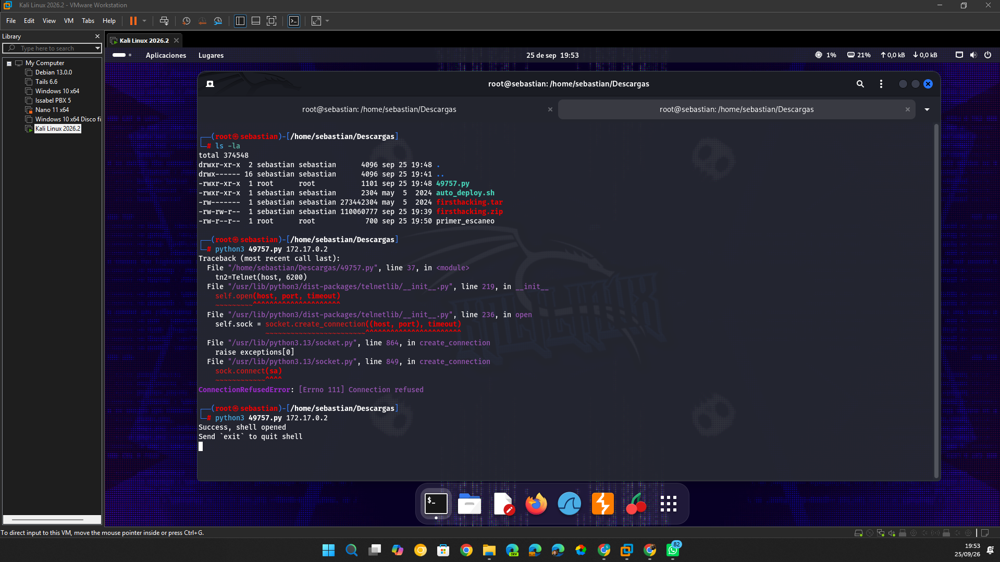{ width=6.1in }

*Figura 19.* Ejecución de la prueba de concepto: primer intento rechazado y segundo intento exitoso.

Dentro de la sesión se confirmó la dirección del objetivo y se procedió a **estabilizar el intérprete
de comandos** (tratamiento de TTY con `script` y ajuste de la variable de entorno `TERM`), un paso
habitual para trabajar cómodamente en una shell obtenida de forma remota.

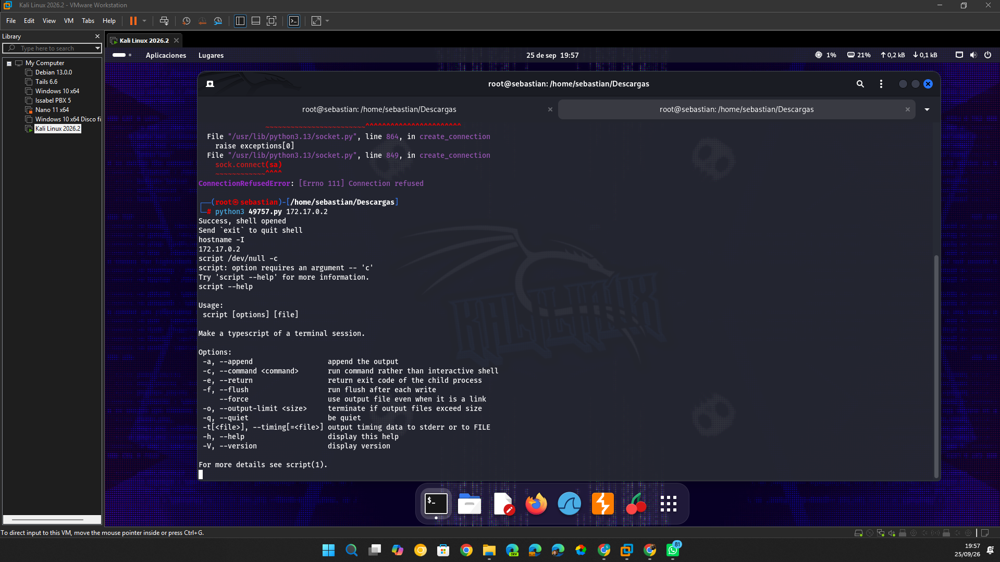{ width=6.1in }

*Figura 20.* Sesión obtenida en el objetivo; `hostname -I` confirma la dirección `172.17.0.2`.

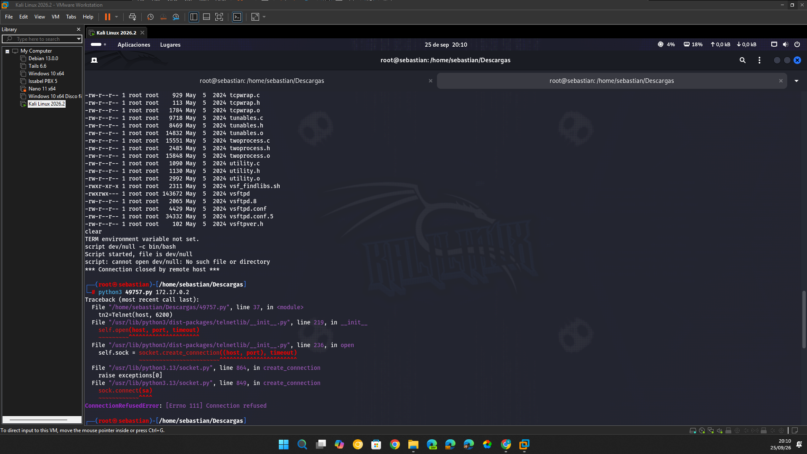{ width=6.1in }

*Figura 21.* Exploración del objetivo: árbol de fuentes del propio `vsftpd-2.3.4` dentro del contenedor.

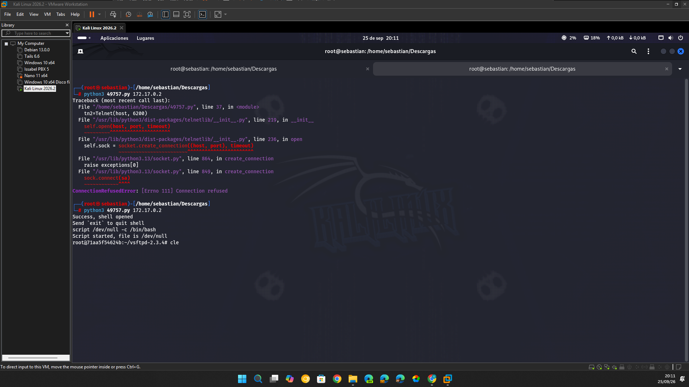{ width=6.1in }

*Figura 22.* Estabilización del intérprete de comandos: el prompt cambia a `root@71aa5f54624b:~/vsftpd-2.3.4#`.

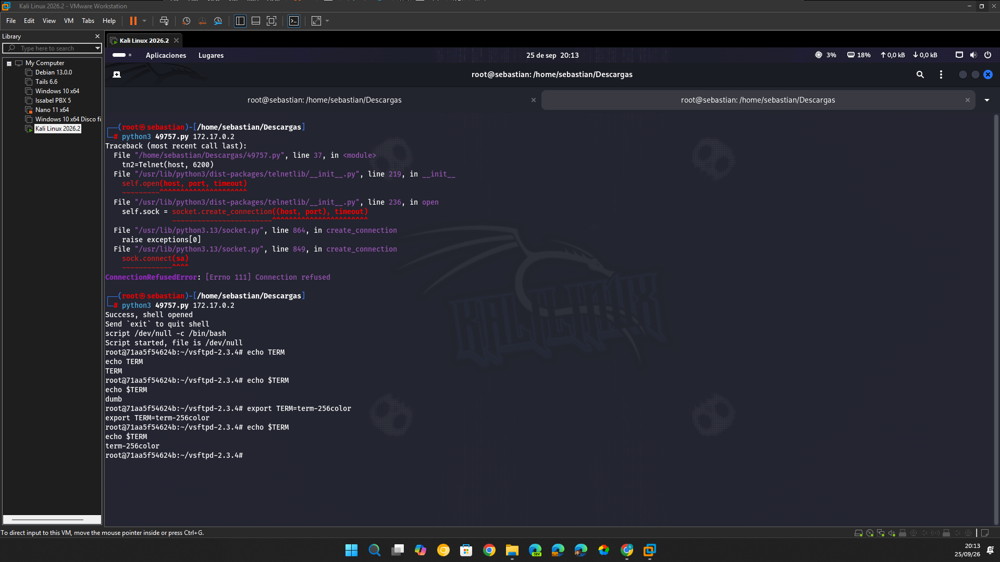{ width=6.1in }

*Figura 23.* Ajuste del entorno de la sesión mediante la variable `TERM`.

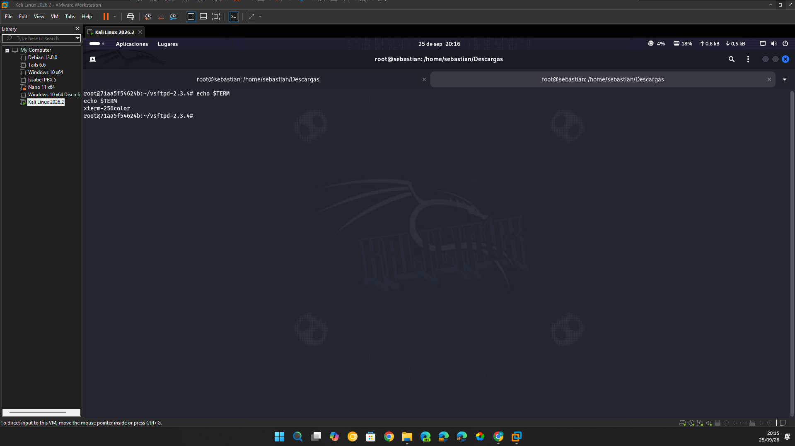{ width=6.1in }

*Figura 24.* Confirmación de la variable de entorno `TERM=xterm-256color`.

**Verificación del nivel de acceso.** Cumpliendo el procedimiento del laboratorio, se comprobó el
usuario de la sesión, el nombre del sistema y la información de red disponible:

- **Usuario de la sesión:** `root` (comando `whoami`).
- **Nombre del sistema (host del contenedor):** `71aa5f54624b`.
- **Dirección del objetivo:** `172.17.0.2`.
- **Host atacante (Kali):** puerta de enlace de Docker `172.17.0.1` e interfaz `192.168.5.136`.

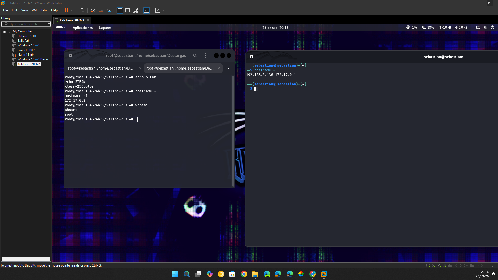{ width=6.1in }

*Figura 25.* Verificación simultánea: en el objetivo `whoami` devuelve `root` y `hostname -I` `172.17.0.2`; a la derecha, el host Kali con `172.17.0.1`.

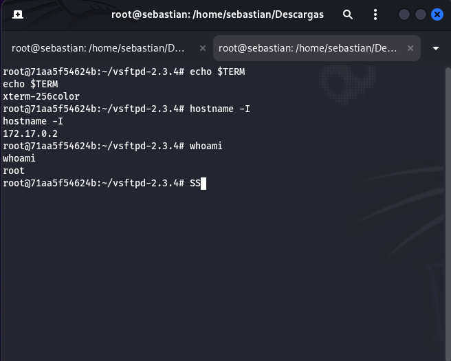{ width=4.5in }

*Figura 26.* Detalle de la verificación de acceso con privilegios de `root` sobre el objetivo.

Conforme a las condiciones de seguridad, **una vez demostrado el acceso** se dio por cumplido el
objetivo académico; no se realizó persistencia, movimiento lateral ni acceso a otros sistemas.

# 9. Actividad complementaria: análisis de tráfico de red

Como valor agregado se analizó el tráfico intercambiado con el objetivo, con el fin de evidenciar de
forma empírica el riesgo de utilizar **protocolos sin cifrado**. A diferencia de SFTP o FTPS, el
protocolo FTP transmite en texto plano tanto el banner y las credenciales como —en este escenario—
los datos que circulan por el canal de la puerta trasera. La captura se realizó con:

```bash
sudo tcpdump -i docker0 -n host 172.17.0.2 -A
```

El parámetro `-A` muestra el contenido de los paquetes en ASCII, e `-i docker0` selecciona la
interfaz del puente de Docker por la que viaja todo el tráfico hacia el contenedor. Al generar en
paralelo una conexión FTP (`ftp 172.17.0.2`, con usuario `anonymous`), la captura mostró **en claro**
el banner del servicio `220 (vsFTPd 2.3.4)` y el resultado del intento de autenticación
(`530 Login incorrect`).

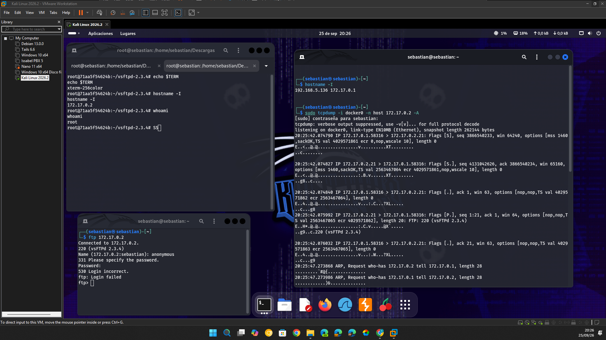{ width=6.1in }

*Figura 27.* Captura con `tcpdump`: el banner `220 (vsFTPd 2.3.4)` y el diálogo FTP viajan en texto plano.

El análisis del canal de la puerta trasera (`6200/tcp`) evidenció que **los comandos y su salida**
también circulan sin cifrado: se observan directamente en la captura la petición de listado de
directorio, su contenido y las respuestas del sistema, además del tráfico ARP asociado a la
resolución de direcciones dentro de la red de Docker.

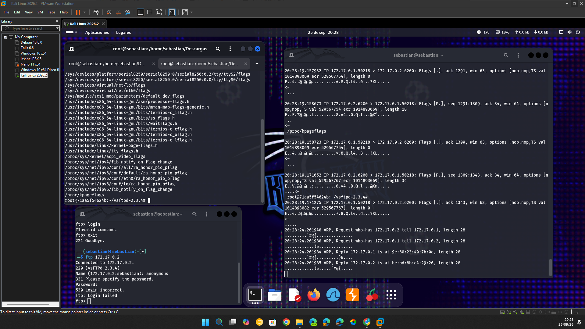{ width=6.1in }

*Figura 28.* Tráfico del canal de la shell (puerto 6200) legible en texto plano.

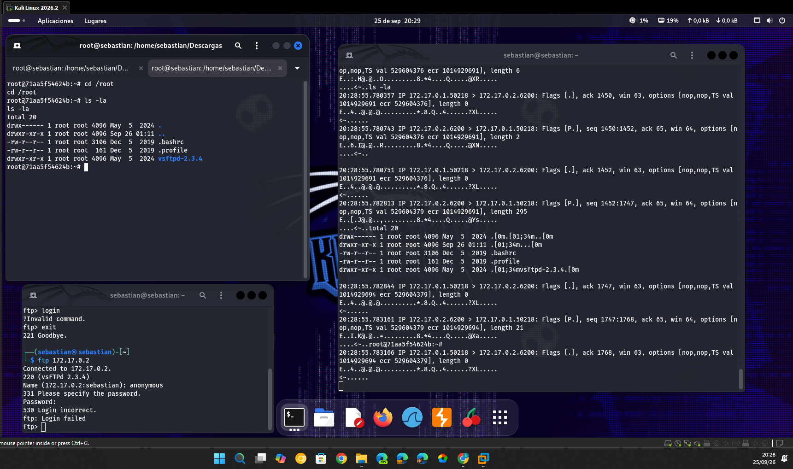{ width=6.1in }

*Figura 29.* Comandos ejecutados (`cd /root`, `ls -la`) y su salida, capturados en claro.

Durante la exploración se buscó además un posible archivo de bandera (`flag`). El comando
`cat flag.txt` devolvió `No such file or directory` en el directorio de trabajo, por lo que **no se
localizó un archivo de bandera** en las rutas inspeccionadas; se continuó con una búsqueda de ficheros
por patrón. La evidencia relevante de esta actividad no es una bandera, sino la **demostración de la
exposición de información en texto plano**, que es precisamente el riesgo que el ejercicio buscaba
ilustrar.

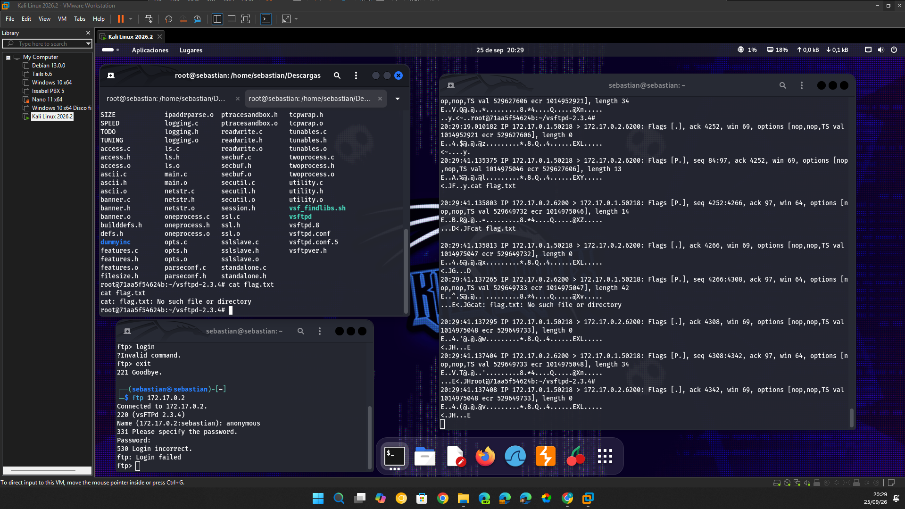{ width=6.1in }

*Figura 30.* Búsqueda de un archivo de bandera: `cat flag.txt` → "No such file or directory".

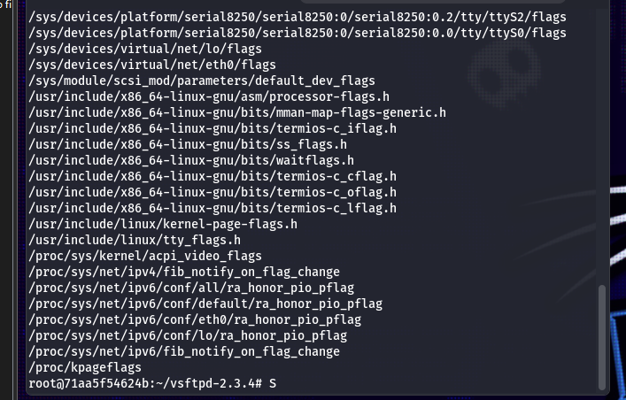{ width=6.1in }

*Figura 31.* Enumeración de ficheros por patrón en `/proc`, `/sys` y `/usr/include`.

# 10. Documentación de comandos: propósito y evidencia

Conforme a la indicación de la actividad —investigar, ejecutar y documentar comandos comprendiendo la función de cada uno—, este apartado consolida los **comandos empleados durante el desarrollo del laboratorio** y, además, **veinte comandos adicionales** investigados y ejecutados de forma independiente. Cada comando se acompaña de su propósito y de la figura donde se evidencia su ejecución.

## 10.1 Comandos empleados en la práctica

| N.° | Comando | Propósito / función | Evidencia |
|:---:|:---|:---|:---:|
| 1 | `file` | Identifica el tipo real de un archivo por su contenido, no por su extensión. | Fig. 8 |
| 2 | `unzip` | Descomprime archivos en formato `.zip`. | Fig. 8 |
| 3 | `ls -la` | Lista archivos con detalle: permisos, propietario, tamaño y ocultos. | Fig. 8 |
| 4 | `tree` | Muestra la estructura de directorios en forma de árbol. | Fig. 9 |
| 5 | `chmod` | Modifica los permisos de un archivo (otorgar ejecución al script). | Fig. 10 |
| 6 | `sudo` | Ejecuta un comando con privilegios de superusuario. | Fig. 11 |
| 7 | `su` | Cambia la sesión al usuario `root`. | Fig. 14 |
| 8 | `apt` | Gestor de paquetes: actualiza el sistema e instala software. | Fig. 13 |
| 9 | `nmap` | Escanea puertos, servicios y versiones de un objetivo. | Fig. 16 |
| 10 | `python3` | Ejecuta scripts en Python (la prueba de concepto). | Fig. 19 |
| 11 | `hostname -I` | Muestra las direcciones IP asignadas al equipo. | Fig. 20 |
| 12 | `whoami` | Muestra el usuario efectivo de la sesión. | Fig. 25 |
| 13 | `script` | Estabiliza la sesión de terminal (mejora la TTY). | Fig. 22 |
| 14 | `export` | Define una variable de entorno (`TERM`). | Fig. 23 |
| 15 | `echo` | Imprime texto o el valor de una variable. | Fig. 24 |
| 16 | `cd` | Cambia el directorio de trabajo. | Fig. 29 |
| 17 | `cat` | Muestra el contenido de un archivo. | Fig. 30 |
| 18 | `ftp` | Cliente de línea de comandos para conectarse a un servidor FTP. | Fig. 27 |
| 19 | `tcpdump` | Captura y analiza el tráfico de red de una interfaz. | Fig. 28 |
| 20 | `man` | Muestra el manual de referencia de un comando. | Fig. 14 |
| 21 | `find` | Busca archivos por nombre o patrón en el sistema de ficheros. | Fig. 31 |

## 10.2 Comandos adicionales investigados y ejecutados

Se seleccionaron veinte comandos **distintos de los anteriores**, relevantes para tres áreas del trabajo de un analista de seguridad: información del sistema, reconocimiento de red y análisis de archivos. Todos fueron ejecutados en Kali Linux; su evidencia se presenta en las figuras posteriores a la tabla.

| N.° | Comando | Propósito / función | Evidencia |
|:---:|:---|:---|:---:|
| 1 | `id` | Muestra el UID, el GID y los grupos de la sesión actual. | Fig. 32 |
| 2 | `uname -a` | Información del kernel y del sistema operativo (versión, arquitectura). | Fig. 32 |
| 3 | `uptime` | Tiempo que lleva encendido el sistema y su carga promedio. | Fig. 32 |
| 4 | `free -h` | Uso de memoria RAM y de intercambio (*swap*). | Fig. 32 |
| 5 | `df -h` | Espacio total, usado y disponible de los sistemas de archivos. | Fig. 32 |
| 6 | `ps aux` | Instantánea de todos los procesos en ejecución. | Fig. 32 |
| 7 | `top` | Monitor de procesos y recursos en tiempo real. | Fig. 33 |
| 8 | `ip a` | Interfaces de red y direcciones IP asignadas. | Fig. 34 |
| 9 | `ip route` | Tabla de enrutamiento (puerta de enlace y rutas). | Fig. 34 |
| 10 | `ss -tuln` | Puertos y sockets en escucha (TCP/UDP). | Fig. 34 |
| 11 | `arp -a` | Tabla ARP: correspondencia entre direcciones IP y MAC. | Fig. 35 |
| 12 | `ping` | Comprueba la conectividad con un host mediante ICMP. | Fig. 35 |
| 13 | `traceroute` | Traza los saltos de red intermedios hasta un destino. | Fig. 35 |
| 14 | `nc (Netcat)` | Abre conexiones, comprueba puertos y captura *banners*. | Fig. 38 |
| 15 | `wget` | Descarga archivos desde la red por HTTP, HTTPS o FTP. | Fig. 36 |
| 16 | `dig` | Realiza consultas al sistema de nombres de dominio (DNS). | Fig. 36 |
| 17 | `grep` | Filtra las líneas que coinciden con un patrón. | Fig. 38 |
| 18 | `head / tail` | Muestran las primeras o las últimas líneas de un archivo. | Fig. 37 |
| 19 | `wc` | Cuenta líneas, palabras y bytes de un archivo. | Fig. 37 |
| 20 | `sha256sum / md5sum` | Calculan el *hash* de un archivo para verificar su integridad. | Fig. 36 |

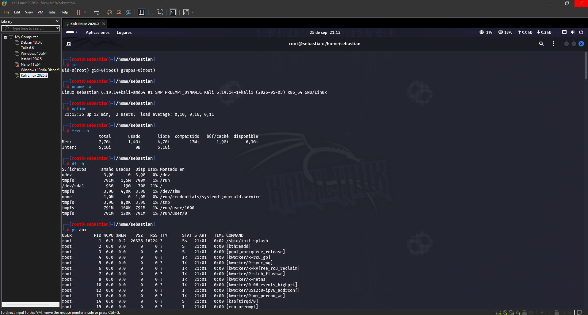{ width=6.1in }

*Figura 32.* Información del sistema: `id`, `uname -a`, `uptime`, `free -h`, `df -h` y `ps aux`.

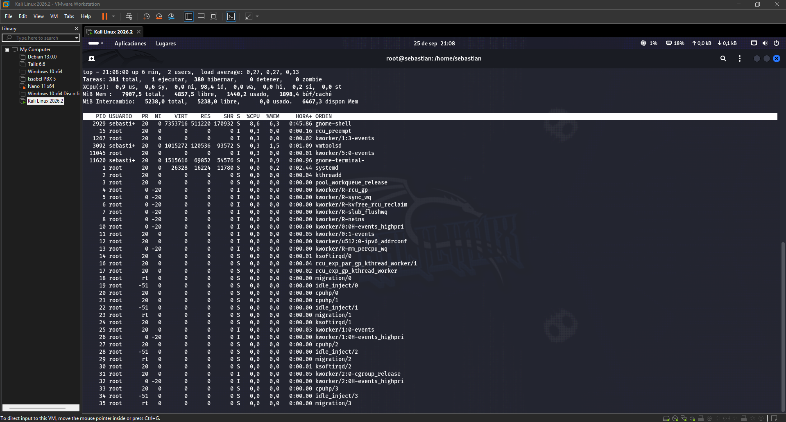{ width=6.1in }

*Figura 33.* Monitor de procesos y recursos en tiempo real con `top`.

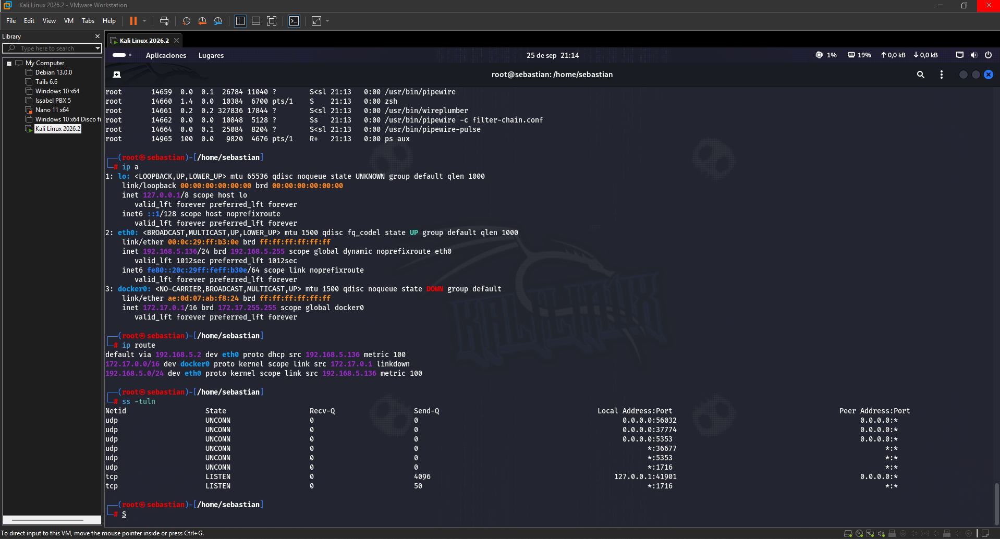{ width=6.1in }

*Figura 34.* Configuración de red: `ip a`, `ip route` y `ss -tuln`.

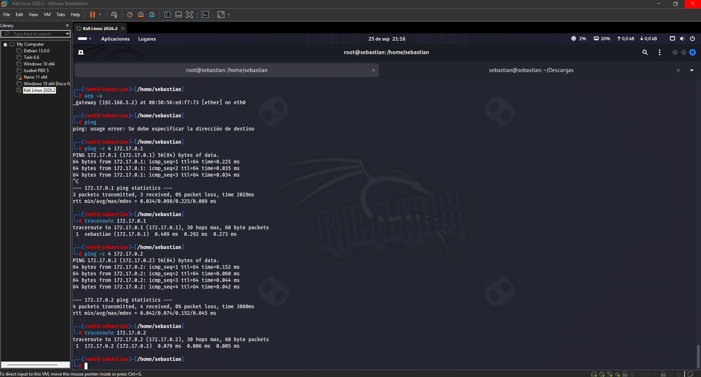{ width=6.1in }

*Figura 35.* Diagnóstico de red: `arp -a`, `ping` y `traceroute` (a `172.17.0.1` y al objetivo `172.17.0.2`).

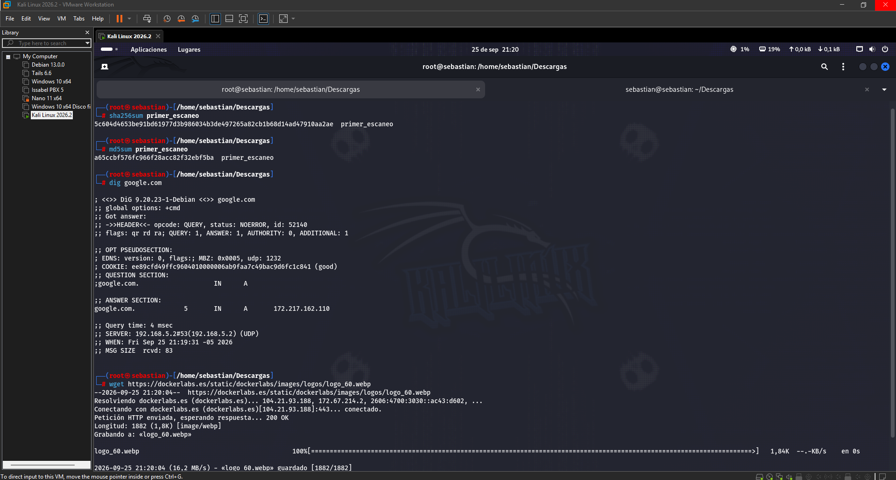{ width=6.1in }

*Figura 36.* Integridad y consultas: `sha256sum`, `md5sum`, `dig` (DNS) y `wget` (descarga).

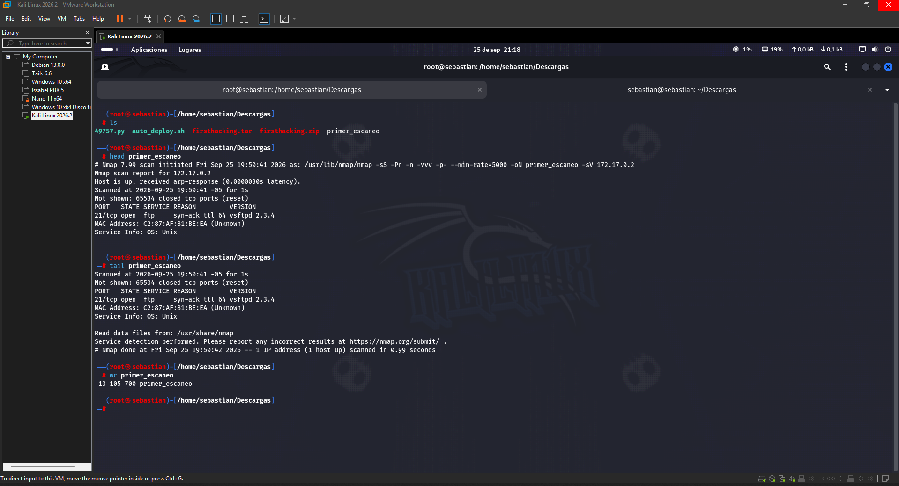{ width=6.1in }

*Figura 37.* Análisis de archivos: `head`, `tail` y `wc` sobre la salida del escaneo.

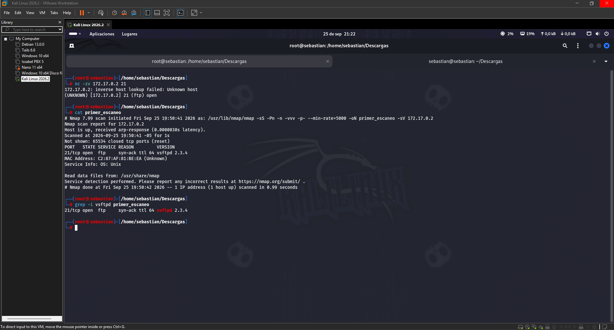{ width=6.1in }

*Figura 38.* Comprobación de puerto con `nc` y filtrado con `grep`.

# 11. Análisis de resultados

- **¿Qué servicio fue identificado como vulnerable?** El servidor FTP **vsftpd 2.3.4** en `21/tcp`.
- **¿Qué vulnerabilidad/CVE se relaciona?** **CVE-2011-2523**, la puerta trasera de vsftpd 2.3.4 que
  permite ejecución remota de comandos como `root`.
- **¿Cuál sería el impacto potencial en una empresa?** El compromiso total del servidor: acceso no
  autorizado con máximos privilegios, robo o alteración de información, uso del equipo como punto de
  pivote hacia otros sistemas y posible interrupción del servicio.
- **¿Qué principios de la tríada CID se verían afectados?**
  - *Confidencialidad:* un atacante con acceso `root` puede leer cualquier dato; además, el tráfico
    FTP en texto plano permite interceptar información sin siquiera explotar el servicio.
  - *Integridad:* con privilegios de `root` es posible modificar o eliminar archivos y
    configuraciones.
  - *Disponibilidad:* el atacante puede detener servicios, cifrar datos o apagar el sistema.
- **¿Qué controles reducirían el riesgo?** Se detallan en la matriz de la sección 12.
- **¿Qué diferencia hay entre identificar y demostrar una vulnerabilidad?** *Identificar* consiste en
  inferir el riesgo a partir de la versión detectada (evidencia indirecta); *demostrar* mediante una
  prueba controlada aporta evidencia empírica del impacto real y de su explotabilidad en el entorno
  concreto, lo que eleva de forma justificada la prioridad de remediación.

# 12. Matriz de vulnerabilidad, riesgo, impacto y control

| Hallazgo | Vulnerabilidad | Riesgo | Impacto | Control / mitigación |
|:---|:---|:---|:---|:---|
| Puerto `21/tcp` con **vsftpd 2.3.4** | **CVE-2011-2523** (backdoor → shell en 6200) | Ejecución remota de comandos como `root` sin autenticación | Compromiso total del host (C, I, D) | **Actualizar** vsftpd a una versión soportada (serie 3.x); retirar binarios comprometidos |
| Servicio FTP expuesto | Protocolo **sin cifrado** (texto plano) | Intercepción de credenciales y datos (sniffing) | Pérdida de confidencialidad | Migrar a **SFTP/FTPS**; segmentar y cifrar el canal |
| Superficie de red amplia | Servicio innecesario accesible | Mayor exposición a exploits públicos | Aumento de la probabilidad de ataque | **Hardening**: cerrar puertos no usados, firewall, mínima exposición |
| Versión de software revelada | Fuga de información de versión (banner) | Facilita la búsqueda de exploits dirigidos | Reconocimiento acelerado del atacante | Ocultar o normalizar banners; gestión de parches |
| Falta de monitorización | Ausencia de detección | Explotación no advertida | Persistencia del atacante | **IDS/IPS**, registro y alertas de conexiones anómalas (p. ej. a `6200/tcp`) |

# 13. Capacidades de virtualización

- **Ventajas de ejecutar Kali como máquina virtual.** Aislamiento respecto al equipo anfitrión,
  instantáneas (*snapshots*) para revertir cambios, portabilidad, y la posibilidad de destruir y
  recrear el entorno sin afectar hardware real. Este laboratorio lo evidenció de primera mano: ante la
  ruptura de Kali 2025.2 se pudo **recuperar** el entorno reinstalando la versión 2026.2, sin ninguna
  consecuencia para el sistema anfitrión.
- **Aporte de una red aislada.** Confina el tráfico ofensivo al laboratorio y evita que la máquina
  vulnerable o las pruebas alcancen redes institucionales o de terceros. Si el objetivo estuviera en
  modo **puente (bridge)** contra la red institucional, un servicio vulnerable como vsftpd 2.3.4
  quedaría expuesto a toda la red corporativa, con riesgo real de compromiso y de uso como punto de
  pivote.
- **Utilidad del snapshot.** Permite volver a un estado limpio y conocido antes de una prueba y
  restaurarlo si esta altera el entorno, garantizando así la repetibilidad del escenario.
- **Máquina virtual frente a contenedor.** Una máquina virtual virtualiza hardware completo y ejecuta
  su propio kernel (aislamiento fuerte); un contenedor —como el objetivo de esta práctica— comparte el
  kernel del anfitrión y aísla a nivel de procesos y espacios de nombres (más ligero, pero con
  aislamiento menor). Por eso el objetivo se ejecuta como contenedor Docker (`71aa5f54624b`) mientras
  que el atacante es una máquina virtual completa.

# 14. Caso empresarial

*Una empresa detecta que uno de sus servidores mantiene un servicio FTP antiguo y decide reproducir la
situación en un laboratorio virtual antes de intervenir el sistema productivo.*

- **Ventajas de reproducir el escenario en una máquina virtual.** Permite validar la vulnerabilidad y
  el efecto de los controles **sin riesgo** para producción, de forma repetible y recuperable.
- **Información previa a recopilar.** Inventario del activo, versión exacta del servicio,
  configuración, exposición de red, autorizaciones y ventana de mantenimiento, y respaldos verificados.
- **Controles en el servidor productivo.** Actualización o parcheo del servicio, migración a
  SFTP/FTPS, segmentación de red y firewall, principio de mínima exposición, monitorización y un
  proceso continuo de gestión de vulnerabilidades.
- **Evidencias a conservar durante la auditoría.** Resultados de escaneos, capturas de tráfico,
  registros de comandos y salidas, cronología y autorizaciones (cadena de custodia).
- **Procedimiento de recuperación si la prueba altera el laboratorio.** Restaurar desde un *snapshot*
  o volver a desplegar el contenedor, devolviendo el entorno a su estado inicial conocido.

# 15. Conclusiones técnicas

1. Se completó de principio a fin el ciclo de una evaluación de seguridad controlada —preparación,
   reconocimiento, enumeración, investigación, validación y análisis— sobre un objetivo autorizado y
   aislado (`172.17.0.2`).
2. El servicio **vsftpd 2.3.4** (puerto `21/tcp`) resultó vulnerable a **CVE-2011-2523**; la prueba de
   concepto controlada demostró la ejecución de comandos con privilegios de **root**, evidenciando la
   diferencia entre *identificar* y *demostrar* una vulnerabilidad.
3. El análisis de tráfico confirmó que FTP transmite en **texto plano**, un riesgo de confidencialidad
   independiente de la puerta trasera; su mitigación pasa por cifrar el canal (SFTP/FTPS) y por una
   gestión de parches oportuna.
4. Las incidencias técnicas (la ruptura de Kali 2025.2 y los errores de permisos y de sintaxis)
   reforzaron el valor de la **virtualización** —recuperación y repetibilidad— y de una metodología
   sistemática de resolución de problemas.
5. Kali Linux se confirma no como un simple conjunto de herramientas ofensivas, sino como una
   **plataforma de aprendizaje, evaluación y validación controlada** de la seguridad.

# 16. Referencias

- Exploit Database. (s. f.). *vsftpd 2.3.4 — Backdoor Command Execution (EDB-ID 49757)*. https://www.exploit-db.com/exploits/49757
- MITRE. (s. f.). *CVE-2011-2523*. Common Vulnerabilities and Exposures. https://cve.mitre.org/cgi-bin/cvename.cgi?name=CVE-2011-2523
- National Institute of Standards and Technology. (s. f.). *CVE-2011-2523 Detail — National Vulnerability Database (NVD)*. https://nvd.nist.gov/vuln/detail/CVE-2011-2523
- Nmap Project. (s. f.). *Nmap Reference Guide*. https://nmap.org/book/man.html
- The Tcpdump Group. (s. f.). *tcpdump(1) man page*. https://www.tcpdump.org/manpages/tcpdump.1.html
- The vsftpd Project. (s. f.). *vsftpd — Very Secure FTP Daemon*. https://security.appspot.com/vsftpd.html
