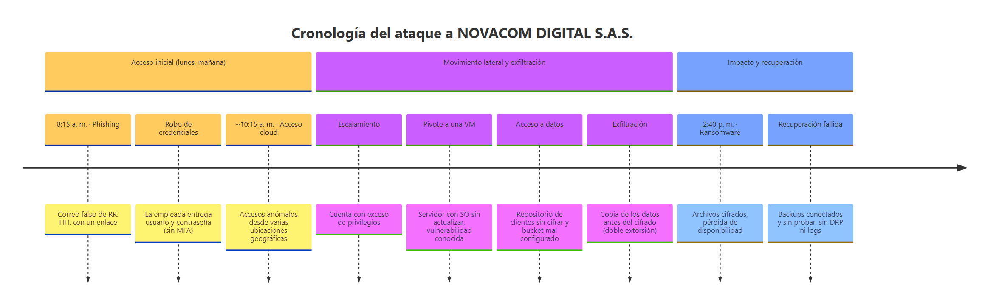
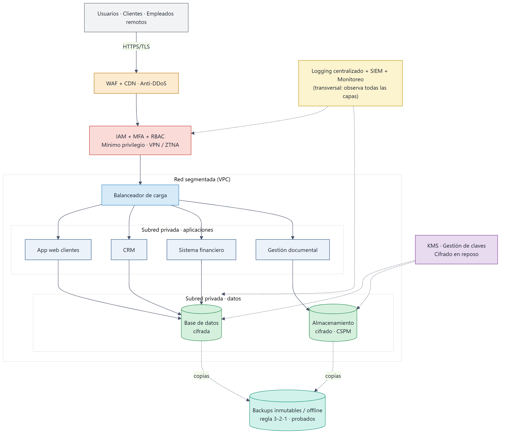
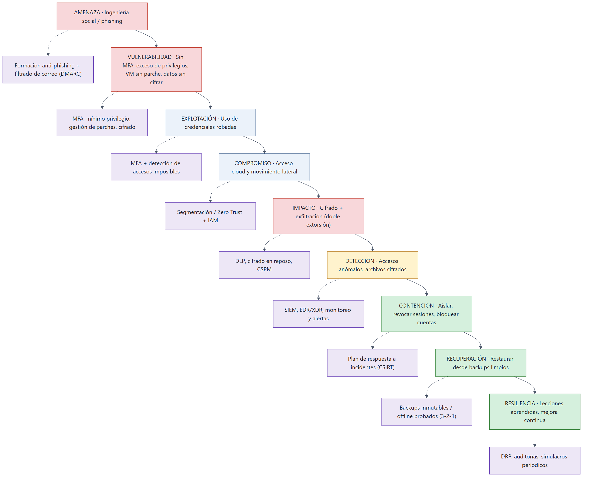
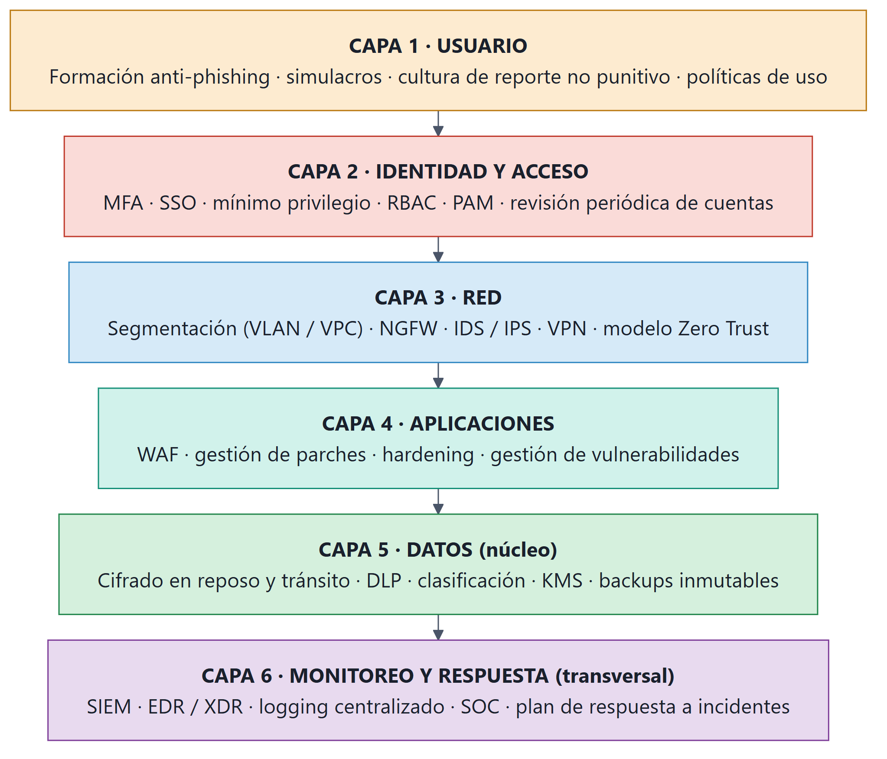

```{=openxml}
<w:p><w:pPr><w:jc w:val="center"/><w:spacing w:before="2000" w:after="120" w:line="360" w:lineRule="auto"/></w:pPr><w:r><w:rPr><w:b/><w:sz w:val="36"/><w:szCs w:val="36"/></w:rPr><w:t xml:space="preserve">Diagnóstico de Seguridad y Plan de Protección</w:t></w:r></w:p><w:p><w:pPr><w:jc w:val="center"/><w:spacing w:before="0" w:after="0" w:line="360" w:lineRule="auto"/></w:pPr><w:r><w:rPr><w:b/><w:sz w:val="34"/><w:szCs w:val="34"/></w:rPr><w:t xml:space="preserve">NOVACOM DIGITAL S.A.S.</w:t></w:r></w:p><w:p><w:pPr><w:jc w:val="center"/><w:spacing w:before="200" w:after="0" w:line="320" w:lineRule="auto"/></w:pPr><w:r><w:rPr><w:sz w:val="26"/><w:szCs w:val="26"/></w:rPr><w:t xml:space="preserve">Informe del Ejercicio Práctico N.° 2 — Análisis y respuesta ante un ciberataque</w:t></w:r></w:p><w:p><w:pPr><w:jc w:val="center"/><w:spacing w:before="1400" w:after="0" w:line="320" w:lineRule="auto"/></w:pPr><w:r><w:rPr><w:b/><w:sz w:val="26"/><w:szCs w:val="26"/></w:rPr><w:t xml:space="preserve">Sebastián López Osorno</w:t></w:r></w:p><w:p><w:pPr><w:jc w:val="center"/><w:spacing w:before="120" w:after="0" w:line="320" w:lineRule="auto"/></w:pPr><w:r><w:rPr><w:sz w:val="24"/><w:szCs w:val="24"/></w:rPr><w:t xml:space="preserve">Politécnico Colombiano Jaime Isaza Cadavid</w:t></w:r></w:p><w:p><w:pPr><w:jc w:val="center"/><w:spacing w:before="0" w:after="0" w:line="320" w:lineRule="auto"/></w:pPr><w:r><w:rPr><w:sz w:val="24"/><w:szCs w:val="24"/></w:rPr><w:t xml:space="preserve">Facultad de Ingenierías — Departamento de Informática</w:t></w:r></w:p><w:p><w:pPr><w:jc w:val="center"/><w:spacing w:before="0" w:after="0" w:line="320" w:lineRule="auto"/></w:pPr><w:r><w:rPr><w:sz w:val="24"/><w:szCs w:val="24"/></w:rPr><w:t xml:space="preserve">Diplomado en Ciberseguridad Informática — Políticas de Seguridad Informática</w:t></w:r></w:p><w:p><w:pPr><w:jc w:val="center"/><w:spacing w:before="0" w:after="0" w:line="320" w:lineRule="auto"/></w:pPr><w:r><w:rPr><w:sz w:val="24"/><w:szCs w:val="24"/></w:rPr><w:t xml:space="preserve">Docente: Edwin Andrés Ochoa Agudelo — Grupo 02</w:t></w:r></w:p><w:p><w:pPr><w:jc w:val="center"/><w:spacing w:before="1000" w:after="0" w:line="320" w:lineRule="auto"/></w:pPr><w:r><w:rPr><w:sz w:val="24"/><w:szCs w:val="24"/></w:rPr><w:t xml:space="preserve">5 de octubre de 2026</w:t></w:r></w:p>
```

# Resumen ejecutivo

El presente informe documenta el **diagnóstico de seguridad** y el **plan de protección y recuperación** elaborados para la empresa colombiana **NOVACOM DIGITAL S.A.S.** tras el ciberataque que sufrió. El equipo de consultoría analizó un incidente de **ransomware multietapa** que comenzó con un correo de **phishing** dirigido al área financiera y terminó con el **cifrado y la exfiltración** de información de clientes, agravado por una **recuperación fallida** debido a copias de seguridad inadecuadas.

El análisis identifica las **amenazas y vulnerabilidades** que hicieron posible el ataque, las examina a la luz de los principios de **Confidencialidad, Integridad y Disponibilidad (CID)** y propone un conjunto integral de controles organizados en una **matriz ataque–control**, una estrategia de **defensa en profundidad** de seis capas, un **plan de respuesta a incidentes** y un **plan de recuperación y resiliencia**. El hilo conductor del diagnóstico es que **ninguna** de las etapas del ataque explotó una técnica sofisticada: todas aprovecharon **controles ausentes o mal implementados** (falta de MFA, exceso de privilegios, ausencia de parches, datos sin cifrar, configuraciones incorrectas en la nube y copias de seguridad conectadas y sin probar). En consecuencia, las medidas propuestas son en su mayoría controles básicos de higiene de seguridad cuya implementación reduce de manera drástica la probabilidad y el impacto de un incidente similar.

El documento se sustenta en el material de la Unidad 3 del diplomado, en el informe de panorama de amenazas de Seresco (2023), en la entrevista *Derecho y ciberseguridad* y en marcos de referencia reconocidos (ISO/IEC 27001, NIST CSF, NIST SP 800-61 y 800-34, RGPD y Directiva NIS), así como en la normativa colombiana aplicable (Ley 1581 de 2012 y Ley 1273 de 2009).

# 1. Introducción

La migración acelerada de NOVACOM DIGITAL S.A.S. hacia servicios en la nube buscó reducir costos y facilitar el trabajo remoto, pero —como reconoce el propio caso— se realizó sin implementar adecuadamente varios controles de seguridad. Ese desfase entre la adopción tecnológica y la madurez de la seguridad es precisamente el terreno donde prosperan los ciberataques actuales.

Este informe asume el rol de un **equipo de consultoría en ciberseguridad** contratado por la dirección de la empresa después del incidente. Su objetivo es doble: **(1) diagnosticar** cómo ocurrió el ataque y qué debilidades lo permitieron, y **(2) proponer** un plan de protección, respuesta y recuperación que eleve la postura de seguridad y la resiliencia digital de la organización.

**Objetivos específicos.**

1. Identificar las amenazas y vulnerabilidades que intervinieron en cada etapa del ataque.
2. Analizar el incidente desde los principios de Confidencialidad, Integridad y Disponibilidad.
3. Rediseñar los controles de acceso bajo el principio de mínimo privilegio.
4. Proponer una arquitectura de seguridad para el entorno en la nube.
5. Relacionar cada etapa del ataque con los controles de prevención, detección y recuperación que correspondían.
6. Diseñar una estrategia de defensa en profundidad, un plan de respuesta a incidentes y un plan de recuperación y resiliencia.

**Alcance y método.** El análisis se limita a la información descrita en el caso; no se inventan datos técnicos adicionales. Los controles propuestos se alinean con marcos reconocidos —ISO/IEC 27001, el *Cybersecurity Framework* (CSF) del NIST y las guías NIST SP 800-61 (respuesta a incidentes) y SP 800-34 (contingencia)— y con el marco legal colombiano de protección de datos (Ley 1581 de 2012) y delitos informáticos (Ley 1273 de 2009). Como premisa rectora se adopta la idea, planteada en el material de la unidad, de que **el riesgo cero no existe**: el propósito de la seguridad no es eliminar toda amenaza, sino reducir el riesgo a un nivel aceptable y preparar a la organización para responder y recuperarse.

# 2. Descripción del incidente

El ataque a NOVACOM se desarrolló en un solo día laboral y progresó a través de cinco etapas encadenadas. Cada etapa fue posible porque un control que debió existir estaba ausente o mal configurado.

- **Etapa 1 — Acceso inicial (8:15 a. m.).** Una empleada del departamento financiero recibió un correo que aparentaba provenir de Recursos Humanos, con el mensaje de que debía «actualizar inmediatamente la información de seguridad de su cuenta» so pena de bloqueo. El correo contenía un enlace; la empleada ingresó y escribió su usuario y contraseña corporativos. Como la organización **no tenía MFA habilitado para todos los usuarios**, esas credenciales bastaron.
- **Etapa 2 — Compromiso de la nube (≈10:15 a. m.).** Dos horas después, el equipo de seguridad detectó accesos inusuales a la cuenta desde ubicaciones geográficas diferentes. El atacante utilizó las credenciales robadas para ingresar a los servicios cloud. La cuenta comprometida **tenía más permisos de los necesarios** (documentos financieros, información de clientes, carpetas administrativas, bases de datos y herramientas colaborativas), de modo que el atacante heredó un acceso muy amplio.
- **Etapa 3 — Movimiento lateral y exposición de datos.** Desde esa cuenta, el atacante se desplazó hacia otros recursos y alcanzó una **máquina virtual con el sistema operativo sin actualizar**, cuya vulnerabilidad conocida explotó. Llegó así a un **repositorio con documentos de clientes** (nombres, identificaciones, direcciones, información de contacto, documentos comerciales e información financiera). Parte de esa información estaba **almacenada sin cifrado adecuado**, y uno de los repositorios de almacenamiento cloud tenía una **configuración incorrecta** que permitía un nivel de acceso superior al requerido.
- **Etapa 4 — Impacto: ransomware y doble extorsión (2:40 p. m.).** Varios empleados reportaron que no podían abrir determinados archivos: los sistemas mostraban que habían sido **cifrados**. La empresa fue víctima de **ransomware**. Además, el atacante había **copiado parte de la información antes de cifrarla**, configurando un escenario de doble extorsión (cifrado + amenaza de publicación).
- **Etapa 5 — Recuperación fallida.** Al intentar restaurar desde las copias de seguridad, el equipo de TI descubrió que algunas **no estaban actualizadas**, que parte de los respaldos estaba **conectada permanentemente** a la infraestructura (y por tanto también fue cifrada), que **no se había probado** recientemente la restauración, que **no existía un procedimiento documentado** de recuperación ante desastres y que **los registros de varias actividades no estaban disponibles**. La organización no pudo determinar con certeza cómo ingresó el atacante, qué información fue consultada o copiada, qué sistemas se comprometieron ni qué podía recuperarse.

La Figura 1 resume la cronología del ataque.

{ width=6.3in }

*Figura 1.* Cronología del ataque a NOVACOM DIGITAL S.A.S., organizada en tres fases: acceso inicial, movimiento lateral y exfiltración, e impacto y recuperación fallida.

# 3. Identificación de amenazas y vulnerabilidades

A partir del caso se identifican las siguientes amenazas y vulnerabilidades. Se distingue entre la **situación encontrada** (el hecho descrito), la **amenaza o vulnerabilidad** que representa y la **razón por la que constituye un riesgo** para la organización.

| N.° | Situación encontrada | Amenaza / Vulnerabilidad | ¿Por qué representa un riesgo? |
|:--:|:---|:---|:---|
| 1 | Correo falso de RR. HH. con un enlace que pide credenciales | Phishing / ingeniería social (factor humano) | Es el vector de entrada más común; engaña al usuario para entregar sus credenciales y evade controles perimetrales. |
| 2 | La empresa no tenía MFA para todos los usuarios | Autenticación débil (ausencia de segundo factor) | Con solo la contraseña robada, el atacante accede directamente; el MFA habría bloqueado el acceso aun con la clave comprometida. |
| 3 | La cuenta comprometida tenía más permisos de los necesarios | Incumplimiento del principio de mínimo privilegio | Amplía el alcance del compromiso: una sola cuenta da acceso a finanzas, clientes, bases de datos y carpetas administrativas. |
| 4 | Máquina virtual con sistema operativo sin actualizar | Gestión de parches deficiente (vulnerabilidad conocida) | Permite explotar una falla ya documentada para el movimiento lateral y la escalada hacia nuevos recursos. |
| 5 | Datos de clientes almacenados sin cifrado adecuado | Falta de cifrado en reposo | La información sensible (PII) queda legible para quien obtenga acceso; agrava el impacto de la exfiltración. |
| 6 | Repositorio cloud con configuración incorrecta | Mala configuración en la nube (*misconfiguration*) | Un acceso superior al requerido expone datos sin necesidad de vulnerar otros controles; es una de las principales causas de brechas cloud. |
| 7 | Backups conectados, desactualizados y sin pruebas | Estrategia de respaldo y recuperación deficiente | El ransomware cifra también los respaldos en línea; sin copias limpias ni pruebas, la recuperación es inviable. |
| 8 | Registros de actividad no disponibles | Ausencia de *logging* y monitoreo | Impide detectar el ataque a tiempo y, después, reconstruir qué pasó (análisis forense y alcance de la brecha). |
| 9 | Migración apresurada sin controles completos | Gobierno de seguridad inmaduro | La velocidad de adopción superó a la seguridad; deja múltiples huecos simultáneos que el atacante encadena. |
| 10 | No existía un procedimiento de recuperación ante desastres | Falta de DRP y de plan de respuesta | Ante el incidente la organización improvisa; se pierden tiempo, información y capacidad de decisión. |

El patrón es claro: el ataque no requirió técnicas avanzadas, sino que **encadenó debilidades básicas**. Esto es coherente con el panorama de amenazas descrito por Seresco (2023), donde el phishing y la ingeniería social se mantienen como el **primer vector de entrada** y las malas configuraciones en la nube y el robo de credenciales encabezan las causas de incidentes.

# 4. Análisis de los principios CID

Los tres principios fundamentales de la seguridad de la información —**Confidencialidad, Integridad y Disponibilidad**— se vieron afectados en distintos momentos del incidente. A continuación se analizan las situaciones más relevantes y el control que debió existir en cada caso.

## 4.1 Confidencialidad

La confidencialidad garantiza que la información solo sea accesible para quien está autorizado. Se identifican tres situaciones que la afectaron:

| Situación | ¿Qué información estuvo en riesgo? | Control que debió implementarse |
|:---|:---|:---|
| Robo de credenciales mediante phishing | Credenciales corporativas y, a través de ellas, todos los servicios cloud de la empleada | MFA obligatorio, formación anti-phishing y filtrado de correo con DMARC/DKIM/SPF |
| Acceso a datos de clientes sin cifrar | Datos personales (PII): nombres, identificaciones, direcciones, información financiera | Cifrado en reposo, gestión de identidades (IAM) y mínimo privilegio; clasificación de la información |
| Exfiltración previa al cifrado y bucket mal configurado | Documentos comerciales y financieros copiados por el atacante | Cifrado, segmentación, prevención de fuga de datos (DLP) y verificación de configuraciones (CSPM) |

El daño a la confidencialidad es especialmente grave porque involucra **datos personales de clientes**, lo que en Colombia activa las obligaciones de la **Ley 1581 de 2012 (Habeas Data)** y su deber de reporte ante la Superintendencia de Industria y Comercio.

## 4.2 Integridad

La integridad protege la exactitud y la ausencia de alteraciones no autorizadas en la información. Se identifican dos situaciones:

- **Cifrado y alteración masiva de archivos por el ransomware.** El malware modificó los archivos (cifrándolos), destruyendo su integridad y disponibilidad simultáneamente. *¿Cómo detectarlo?* Mediante **funciones de hash / checksums** que evidencian cambios, **control de versiones** y agentes **EDR/XDR** que detectan el comportamiento de cifrado masivo. *Controles recomendados:* copias de seguridad **inmutables**, control de versiones y detección de anomalías.
- **Posible manipulación de registros y datos por una cuenta con privilegios excesivos.** Un atacante con permisos amplios puede alterar registros financieros o **borrar los logs** para ocultar su rastro (de hecho, varios registros no estaban disponibles). *¿Cómo detectarlo?* Con **sistemas de detección de intrusiones (IDS)**, **registros de auditoría** centralizados y protegidos (almacenamiento WORM/inmutable) y correlación en un **SIEM**. *Controles recomendados:* mínimo privilegio, MFA y protección de la integridad de los registros.

Estos controles corresponden a los conceptos sugeridos por la guía: *hashing*, control de versiones, IDS y registros de auditoría.

## 4.3 Disponibilidad

La disponibilidad asegura que los usuarios autorizados puedan acceder a la información cuando la necesitan. Se identifican tres situaciones:

- **El ransomware cifró los archivos** y los empleados dejaron de poder abrirlos: pérdida directa de disponibilidad de la operación.
- **Las copias de seguridad no eran utilizables** (desactualizadas, conectadas y sin pruebas), por lo que no permitieron restablecer el servicio.
- **La dependencia de servicios y canales únicos** dejó a la organización sin alternativas durante la crisis.

*¿Por qué dejaron de acceder los usuarios?* Porque el activo (los archivos) fue cifrado y no existía una vía de restauración rápida ni redundancia. *¿Qué controles habrían reducido el impacto?*

- **Backups** correctos (regla 3-2-1, con copias desconectadas e inmutables y pruebas de restauración) permiten volver a un estado limpio sin pagar rescate.
- **Redundancia** (alta disponibilidad, réplicas en varias zonas) evita que un único punto de fallo paralice el servicio.
- Un **plan de recuperación ante desastres (DRP)** define procedimientos, responsables y objetivos de tiempo (RTO) y de punto de recuperación (RPO) para restablecer los servicios críticos de forma ordenada.

El material de la unidad ilustra esta dependencia con el caso de la caída de Facebook/WhatsApp/Instagram y con el ejemplo de una organización que solo se comunicaba por un canal: cuando ese canal cae, **se necesita un canal de respaldo**. La disponibilidad, por tanto, se protege con redundancia, copias y planes de continuidad.

# 5. Análisis de controles de acceso

El sistema de acceso de NOVACOM se basaba en contraseñas, con usuarios con demasiados privilegios, sin MFA generalizado, con acceso remoto y recursos en la nube. Esta combinación fue determinante en la propagación del ataque.

## 5.1 Propuesta de control de acceso

| Control | Situación actual | Propuesta | Riesgo que reduce |
|:---|:---|:---|:---|
| Autenticación | Solo usuario y contraseña | Contraseñas robustas + gestor de contraseñas + política de bloqueo | Credenciales débiles y reutilizadas |
| MFA | Ausente para varios usuarios | **MFA obligatorio** para todos (preferiblemente resistente a phishing) | Uso de credenciales robadas |
| Autorización | Permisos amplios por cuenta | Autorización basada en roles (RBAC) y por necesidad de saber | Acceso indebido a recursos no pertinentes |
| Mínimo privilegio | No aplicado | Asignar solo los permisos imprescindibles; accesos temporales (JIT) | Escalada y movimiento lateral |
| Roles | Sin definición clara de roles | Catálogo de roles por función con permisos documentados | Acumulación de privilegios |
| Gestión de cuentas | Sin revisión ni bajas oportunas | Alta/baja controlada, revisión periódica y desactivación inmediata | Cuentas huérfanas y privilegios heredados |
| Acceso remoto | Acceso directo a la nube | VPN / ZTNA, dispositivos verificados y MFA | Accesos remotos no confiables |

## 5.2 Matriz de roles (política de acceso basada en roles)

Se propone la siguiente matriz, usando la convención **A** = acceso administrativo, **L** = lectura, **M** = modificación y **–** = sin acceso.

| Recurso | Finanzas | RR. HH. | TI | Gerencia | Cliente |
|:---|:--:|:--:|:--:|:--:|:--:|
| Información financiera | M | – | L | L | – |
| Información de empleados | – | M | – | L | – |
| Base de datos de clientes | L | – | A | L | – |
| Servidores | – | – | A | – | – |
| Documentos administrativos | L | L | – | M | – |

**Justificación.** La matriz aplica el principio de **mínimo privilegio** y de **necesidad de saber**: cada rol accede únicamente a lo que su función exige. *Finanzas* modifica la información financiera y solo lee la base de clientes para su gestión. *RR. HH.* administra la información de empleados, que nadie más necesita modificar. *TI* administra servidores y la base de datos (soporte técnico), pero **no** requiere acceso de negocio a la información financiera o de empleados: se separa la administración de la infraestructura del acceso al contenido (segregación de funciones). *Gerencia* lee la mayoría de los recursos para su labor de supervisión y modifica los documentos administrativos. El *Cliente* **no** accede directamente a ningún repositorio interno; interactúa solo con sus propios datos a través de la aplicación web, nunca contra la base de datos. Precisamente la ausencia de esta segmentación —una cuenta con acceso a todo— fue lo que permitió que el compromiso de una sola credencial escalara a toda la organización.

# 6. Análisis de seguridad en la nube

## 6.1 Identificación de los servicios cloud

A partir de la descripción de NOVACOM, los recursos se relacionan con los modelos de servicio y de implementación de la siguiente manera:

| Servicio / recurso | Modelo | Justificación |
|:---|:---|:---|
| Máquina virtual | IaaS (nube pública o híbrida) | La empresa gestiona el sistema operativo y el software; el proveedor aporta la infraestructura. La responsabilidad de parcheo es del cliente (y aquí falló). |
| Correo corporativo | SaaS (nube pública) | Servicio consumido «como aplicación»; el proveedor administra la plataforma y el cliente, las cuentas y la configuración. |
| Aplicación web para clientes | PaaS / IaaS | Plataforma o infraestructura para desplegar y operar la aplicación propia de cara al cliente. |
| Almacenamiento de archivos en la nube | IaaS / SaaS | Almacenamiento gestionado; su seguridad depende en gran medida de una configuración correcta (aquí hubo *misconfiguration*). |
| Base de datos | PaaS (base de datos gestionada) | El proveedor administra el motor; el cliente, los datos, los accesos y el cifrado. |

En cuanto al **modelo de implementación**, NOVACOM opera de hecho una **nube híbrida**: servicios **públicos** (correo SaaS, almacenamiento) conviven con componentes que deberían tratarse como **privados** por su sensibilidad (datos de clientes, sistema financiero). Un principio transversal es el de **responsabilidad compartida**: el proveedor asegura la nube, pero el cliente es responsable de la seguridad *en* la nube (identidades, configuraciones, cifrado y datos).

## 6.2 Arquitectura de seguridad cloud propuesta

Se proponen los siguientes controles, cada uno vinculado al problema del caso que ayuda a resolver. La Figura 2 ilustra cómo se integran.

| N.° | Control | Problema del caso que ayuda a resolver |
|:--:|:---|:---|
| 1 | **IAM** (gestión de identidades y accesos) | Centraliza y controla quién accede a qué; base del mínimo privilegio. |
| 2 | **MFA** | Impide el uso de credenciales robadas por phishing. |
| 3 | **Mínimo privilegio / RBAC** | Evita que una cuenta comprometida acceda a toda la organización. |
| 4 | **Cifrado en reposo** (con KMS) | Protege los datos de clientes aunque el repositorio sea alcanzado. |
| 5 | **Cifrado en tránsito** (TLS/HTTPS) | Protege la información mientras viaja entre usuario y servicios. |
| 6 | **Segmentación de red** (VPC/subredes) | Contiene el movimiento lateral entre la VM comprometida y los datos. |
| 7 | **Firewall / NGFW + WAF** | Filtra el tráfico y protege la aplicación web de clientes. |
| 8 | **Gestión de parches** | Elimina la vulnerabilidad conocida de la máquina virtual. |
| 9 | **Logging centralizado** | Permite detectar el ataque y reconstruir lo ocurrido (ausente en el caso). |
| 10 | **Monitoreo / SIEM + alertas** | Detecta accesos anómalos (como los de ubicaciones distintas) en tiempo real. |
| 11 | **Backups inmutables / offline** | Garantiza la recuperación frente al ransomware. |
| 12 | **Gestión de claves y certificados (KMS)** | Administra de forma segura las claves de cifrado y los certificados TLS. |
| 13 | **CSPM** (gestión de postura cloud) | Detecta y corrige configuraciones incorrectas como el bucket expuesto. |
| 14 | **Evaluación del proveedor** | Verifica el reparto de responsabilidades y el cumplimiento del proveedor. |

{ width=6.3in }

*Figura 2.* Arquitectura de seguridad cloud propuesta: el tráfico entra por un WAF/CDN, se autentica con IAM + MFA, atraviesa una red segmentada (VPC) con subredes separadas para aplicaciones y datos, con cifrado gestionado por KMS, copias inmutables fuera de línea y monitoreo (SIEM) transversal.

# 7. Matriz ataque–control

Esta sección —una de las centrales del ejercicio— relaciona cada etapa del ataque con el principio CID afectado y con los controles que debieron **prevenirlo, detectarlo o permitir la recuperación**.

| Etapa del ataque | Vulnerabilidad | CID afectado | Control preventivo | Control de detección | Control de recuperación |
|:---|:---|:--:|:---|:---|:---|
| Phishing | Factor humano, sin filtrado de correo | Confid. | Formación, DMARC/SPF/DKIM | Pasarela de correo, reporte del usuario | Restablecer credenciales |
| Robo de credenciales | Autenticación sin MFA | Confid. | MFA, contraseñas robustas | Alertas de inicio de sesión | Reset de credenciales, revocar sesiones |
| Acceso cloud | Credenciales válidas sin verificación | Confid. | MFA, ZTNA | Detección de accesos imposibles (SIEM) | Bloquear cuenta, cerrar sesiones |
| Escalamiento de privilegios | Exceso de privilegios | Confid./Integr. | Mínimo privilegio, RBAC, PAM | Auditoría de accesos | Retirar privilegios, aislar cuenta |
| Vulnerabilidad del servidor | VM sin parche | Integr./Disp. | Gestión de parches, hardening | Escaneo de vulnerabilidades, IDS | Reimagen/parcheo de la VM |
| Exposición de datos | Sin cifrado + bucket mal configurado | Confid. | Cifrado en reposo, CSPM, DLP | Monitoreo de accesos y de egress | Rotación de secretos, notificación |
| Ransomware | Sin EDR, red plana | Disp./Integr. | EDR/XDR, segmentación | EDR, alertas de cifrado masivo | Restaurar desde backups limpios |
| Pérdida de información | Backups conectados y sin pruebas, sin logs | Disp. | Backups 3-2-1 inmutables, logging | Pruebas de restauración, SIEM | DRP, restauración priorizada |

Como cierre de esta sección, la Figura 3 presenta el **mapa visual de la anatomía del ataque**, que recorre las etapas de amenaza, vulnerabilidad, explotación, compromiso, impacto, detección, contención, recuperación y resiliencia, anotando en cada una el control que corresponde.

{ width=6.0in }

*Figura 3.* Anatomía del ataque a NOVACOM: de la amenaza a la resiliencia, con el control asociado a cada etapa (líneas punteadas).

# 8. Estrategia de defensa en profundidad

La defensa en profundidad parte de asumir que cualquier control individual puede fallar; por eso se despliegan **múltiples capas** de protección, de modo que, si una es superada, las siguientes contengan el avance del atacante. Es la misma lógica de las murallas concéntricas de una ciudad medieval aplicada a la seguridad de la información. Para NOVACOM se propone una estrategia de **seis capas** (Figura 4):

1. **Capa 1 — Usuario.** Formación continua anti-phishing, simulacros de phishing, cultura de reporte **no punitivo** (para que quien se equivoque avise de inmediato) y políticas de uso aceptable. Habría atacado directamente la causa de la Etapa 1.
2. **Capa 2 — Identidad y acceso.** MFA, SSO, mínimo privilegio, RBAC, gestión de accesos privilegiados (PAM) y revisión periódica de cuentas. Habría bloqueado las Etapas 2 y 3.
3. **Capa 3 — Red.** Segmentación (VLAN/VPC), NGFW, IDS/IPS, VPN y modelo **Zero Trust**. Habría contenido el movimiento lateral.
4. **Capa 4 — Aplicaciones.** WAF, gestión de parches, *hardening* y gestión de vulnerabilidades. Habría cerrado la vulnerabilidad de la VM.
5. **Capa 5 — Datos (núcleo).** Cifrado en reposo y en tránsito, DLP, clasificación de la información, KMS y backups inmutables. Habría reducido el impacto de la exfiltración y del cifrado.
6. **Capa 6 — Monitoreo y respuesta (transversal).** SIEM, EDR/XDR, *logging* centralizado, SOC y plan de respuesta a incidentes. Habría permitido **detectar** el ataque en curso y responder a tiempo.

{ width=6.0in }

*Figura 4.* Estrategia de defensa en profundidad de seis capas propuesta para NOVACOM, desde el usuario hasta los datos, con el monitoreo y la respuesta como capa transversal.

# 9. Plan de respuesta al incidente

Supóngase que son las **3:00 p. m.** y el ransomware continúa propagándose. Como responsable de seguridad, se ejecutarían las siguientes acciones **en este orden**, siguiendo el ciclo de respuesta a incidentes de NIST SP 800-61 (identificación → contención → erradicación → recuperación → lecciones aprendidas):

1. **Activar el plan de respuesta y convocar al equipo (CSIRT).** Declarar formalmente el incidente, asignar roles y designar un vocero único. La guía lo resume bien: en un incidente, *«los minutos son oro»* y no se puede improvisar.
2. **Contener de inmediato.** Aislar de la red los equipos afectados (desconectarlos/segmentarlos), **revocar sesiones y tokens**, **bloquear las cuentas comprometidas** y cortar la propagación. Es la prioridad porque el cifrado sigue avanzando.
3. **Preservar la evidencia.** Antes de apagar o reinstalar, recolectar y proteger los registros y las imágenes forenses disponibles, para el análisis posterior y para las obligaciones legales.
4. **Erradicar la amenaza.** Eliminar el malware, cerrar el vector de entrada: **restablecer credenciales**, **forzar MFA** y **parchear** la máquina virtual vulnerable.
5. **Evaluar el alcance.** Determinar qué sistemas se comprometieron y qué información fue consultada, copiada o cifrada —en especial los datos personales de clientes.
6. **Recuperar.** Restaurar los servicios desde **copias de seguridad limpias y verificadas**, priorizando los sistemas críticos (financiero, CRM, base de datos de clientes, correo).
7. **Notificar.** Informar a la dirección, a los **afectados** y a las **autoridades** competentes dentro de los plazos legales (en Colombia, a la Superintendencia de Industria y Comercio conforme a la Ley 1581 de 2012; en contextos con RGPD, dentro de las 72 horas).
8. **Lecciones aprendidas.** Realizar el análisis posterior, cerrar las brechas detectadas y actualizar las políticas, los controles y el propio plan.

**Justificación del orden.** La **contención** va primero porque el daño continúa materializándose: detener la propagación limita el impacto. La **preservación de evidencia** precede a la erradicación para no destruir rastros necesarios. La **erradicación** antecede a la **recuperación** para no restaurar sobre un entorno aún comprometido (y volver a ser cifrado). La **notificación** es una obligación legal y de confianza que debe cumplirse en plazos definidos. Como recomendación, **no se aconseja pagar el rescate**: no garantiza la recuperación, financia la actividad criminal y no elimina el riesgo de publicación de los datos exfiltrados.

# 10. Plan de recuperación y resiliencia

La recuperación fallida fue, junto con el phishing, el punto más crítico del caso. Se propone un plan básico de recuperación con los siguientes elementos:

- **Estrategia de backup — regla 3-2-1 (reforzada a 3-2-1-1-0):** 3 copias, en 2 medios distintos, 1 fuera de sitio, **1 inmutable o desconectada (*air-gap*)** y **0 errores verificados** en las restauraciones.
- **Frecuencia:** según la criticidad y el RPO de cada servicio; los sistemas financieros, el CRM y la base de datos de clientes con copias frecuentes (horarias o continuas), el resto a diario.
- **Ubicación de las copias:** fuera del sitio principal, en una región/cuenta cloud distinta, con al menos una copia desconectada de la red.
- **Protección de los backups:** **inmutabilidad (WORM)**, cifrado y **credenciales separadas** de las de producción, para que el ransomware no pueda cifrarlos (el error del caso fue tenerlos conectados).
- **Pruebas de restauración:** periódicas y documentadas; una copia que no se ha probado no es un respaldo confiable.
- **Redundancia:** alta disponibilidad y réplicas en varias zonas para los servicios críticos.
- **Recuperación ante desastres (DRP):** procedimiento documentado con responsables y con objetivos de tiempo (RTO) y de punto de recuperación (RPO) por servicio.
- **Priorización de servicios críticos:** orden de restablecimiento claro (sistema financiero, CRM, base de datos de clientes y correo antes que el resto).
- **Comunicación durante el incidente:** plan de comunicación con vocero designado, mensajes a clientes y autoridades, y **un canal de comunicación alterno** —la lección del material de la unidad: no depender de un único medio que, si cae, deja a la organización incomunicada.

## 10.1 Reflexión: ¿la empresa quedaría «completamente protegida»?

Aunque NOVACOM implemente todos los controles propuestos, **no quedaría completamente protegida**, porque **el riesgo cero no existe**. El **riesgo** es función de la **amenaza**, la **vulnerabilidad** y el **impacto**: los controles reducen la probabilidad y el impacto, pero no los anulan. Siempre aparecen nuevas amenazas y vulnerabilidades (incluidas las de día cero), y el **factor humano** sigue siendo falible. Por eso la seguridad no se agota en la **prevención**: debe sostenerse sobre un ciclo completo de **prevención → detección → respuesta → recuperación → resiliencia**, con mejora continua. El objetivo realista es **gestionar el riesgo residual** y lograr que, cuando ocurra un incidente —porque tarde o temprano ocurrirá—, la organización lo **detecte pronto, responda bien y se recupere rápido**. Esa capacidad es, precisamente, la **resiliencia digital**.

# 11. Relación con el material de la unidad y el video

El video *Derecho y ciberseguridad* (entrevista a la abogada Rosario Murga Ruiz) y el material de la unidad ofrecen conceptos que se aplican directamente al caso de NOVACOM. La siguiente tabla relaciona cinco elementos observados con su concepto de ciberseguridad y su conexión con el caso.

| N.° | Elemento observado en el video / material | Concepto de ciberseguridad | Relación con NOVACOM |
|:--:|:---|:---|:---|
| 1 | La caída de Facebook/WhatsApp/Instagram, estudiada como posible ciberataque | Pérdida de **Disponibilidad** (tríada CIA) | El ransomware rompió la disponibilidad de NOVACOM: a las 2:40 p. m. los empleados no podían abrir sus archivos. |
| 2 | «La mayoría de las brechas ocurren porque alguien hizo clic»; el correo falso del banco | **Ingeniería social / phishing** y factor humano | El ataque a NOVACOM comenzó con un clic en un correo falso de RR. HH. por parte de una empleada. |
| 3 | La Directiva NIS y el deber de **notificar** los incidentes a las autoridades | **Cumplimiento regulatorio** y notificación de brechas | NOVACOM debe notificar la brecha de datos de clientes a la autoridad (en Colombia, la SIC — Ley 1581 de 2012). |
| 4 | «Los minutos son oro»: tener un **procedimiento** de actuación, roles y vocero | **Respuesta a incidentes** y gestión de crisis | NOVACOM no tenía DRP ni procedimiento documentado, lo que agravó el impacto y retrasó la respuesta. |
| 5 | El caso del hospital y la necesidad de un canal de respaldo; «el riesgo cero no existe» | **Resiliencia** y continuidad del negocio | Los backups de NOVACOM estaban conectados y sin probar; faltaba redundancia, canal alterno y preparación. |

**Pregunta final: ¿qué concepto del video tiene una aplicación directa en la prevención o respuesta al ataque de NOVACOM?** El concepto de mayor aplicación directa es que **«los minutos son oro» y que se requiere un procedimiento de respuesta preconcebido y ensayado**. Técnicamente, esto se traduce en disponer de un **plan de respuesta a incidentes** con un equipo (CSIRT), roles definidos, vocería, árbol de decisiones de contención y plazos de notificación. En el caso de NOVACOM, la ausencia de este procedimiento —sumada a la falta de registros— impidió **contener** el ransomware mientras se propagaba y **reconstruir** lo ocurrido. Un segundo concepto igualmente aplicable, esta vez en la **prevención**, es la **concienciación del factor humano**: dado que el ataque entró por un clic, un programa de formación y simulacros de phishing, junto con MFA, habría cortado la cadena en su primer eslabón.

# 12. Conclusiones

El ataque a NOVACOM DIGITAL S.A.S. no fue el resultado de una técnica extraordinaria, sino de la **acumulación de controles básicos ausentes**: un correo de phishing, la falta de MFA, el exceso de privilegios, una máquina sin parchear, datos sin cifrar, una configuración cloud incorrecta y, finalmente, unas copias de seguridad inservibles. Cada eslabón habilitó al siguiente. La buena noticia es que, por la misma razón, el ataque era **altamente prevenible**: los controles que faltaban son, en su mayoría, higiene de seguridad de primer nivel.

El plan propuesto ataca el problema en las tres dimensiones de la rúbrica: **prevención** (MFA, mínimo privilegio, parches, cifrado, segmentación, formación), **detección** (logging, SIEM, EDR, CSPM) y **recuperación/resiliencia** (backups inmutables probados, DRP, redundancia y plan de comunicación). Por encima de los controles individuales, la lección estratégica es adoptar un enfoque de **defensa en profundidad** y asumir que, dado que el riesgo cero no existe, la meta es la **resiliencia**: detectar pronto, responder bien y recuperarse rápido.

## 12.1 Primeras cinco decisiones de los primeros 30 días

Si se asumiera la responsabilidad de ciberseguridad de NOVACOM, estas serían las cinco primeras decisiones, priorizadas, con el riesgo que cada una reduce:

| N.° | Decisión | Riesgo que reduce |
|:--:|:---|:---|
| 1 | Habilitar **MFA** en todas las cuentas y **restablecer** las credenciales | Uso de credenciales robadas (el vector del ataque) |
| 2 | Establecer **backups inmutables/offline** y **probar** una restauración | Pérdida de información e indisponibilidad por ransomware |
| 3 | Revisar privilegios: aplicar **mínimo privilegio/RBAC** y dar de baja cuentas excesivas | Escalada y movimiento lateral |
| 4 | **Parchear** y corregir **configuraciones cloud** (CSPM) | Explotación de la VM y exposición por *misconfiguration* |
| 5 | Desplegar **logging/SIEM** y aprobar un **plan de respuesta** + formación anti-phishing | Falta de detección y factor humano |

**Orden y porqué.** Se prioriza primero **frenar el sangrado** (MFA y reset cierran la puerta por la que entró el atacante); luego **asegurar la capacidad de recuperación** (backups probados, lo único que neutraliza la extorsión por cifrado); después **reducir la superficie de ataque** (mínimo privilegio, parches y configuraciones); y, finalmente, **ganar visibilidad y preparación** (monitoreo, plan de respuesta y formación). Este orden refleja que, ante recursos y tiempo limitados, conviene atender primero lo que detiene el daño inmediato y garantiza la supervivencia de la operación, antes de construir las capacidades de mediano plazo.

# 13. Referencias

- Cichonski, P., Millar, T., Grance, T., & Scarfone, K. (2012). *Computer Security Incident Handling Guide* (NIST SP 800-61 Rev. 2). National Institute of Standards and Technology.
- Congreso de la República de Colombia. (2009). *Ley 1273 de 2009. Por medio de la cual se modifica el Código Penal… (de la protección de la información y de los datos)*.
- Congreso de la República de Colombia. (2012). *Ley 1581 de 2012. Por la cual se dictan disposiciones generales para la protección de datos personales (Habeas Data)*.
- ISO/IEC. (2022). *ISO/IEC 27001:2022 — Information security management systems — Requirements*. International Organization for Standardization.
- Murga Ruiz, R. (s. f.). *Derecho y ciberseguridad* [Video]. YouTube. https://www.youtube.com/watch?v=TMOL_s4I9zI
- National Institute of Standards and Technology. (2018). *Framework for Improving Critical Infrastructure Cybersecurity, Version 1.1 (Cybersecurity Framework)*.
- Ochoa Agudelo, E. A. (2026). *Ejercicio práctico N.° 2: El ataque a NOVACOM DIGITAL S.A.S.* [Guía de laboratorio]. Politécnico Colombiano Jaime Isaza Cadavid, Diplomado en Ciberseguridad Informática.
- Ochoa Agudelo, E. A. (2026). *Unidad 3 — Políticas, controles y cultura organizacional* [Material de presentación]. Diplomado en Ciberseguridad Informática.
- Parlamento Europeo y Consejo de la Unión Europea. (2016). *Reglamento (UE) 2016/679 (Reglamento General de Protección de Datos, RGPD)*.
- Parlamento Europeo y Consejo de la Unión Europea. (2016). *Directiva (UE) 2016/1148 relativa a la seguridad de las redes y sistemas de información (Directiva NIS)*.
- Seresco. (2023). *Presente y futuro de la ciberseguridad en 2023* (TLP:CLEAR). Equipo de Ciberseguridad de Seresco. https://www.seresco.es
- Swanson, M., Bowen, P., Phillips, A. W., Gallup, D., & Lynes, D. (2010). *Contingency Planning Guide for Federal Information Systems* (NIST SP 800-34 Rev. 1). National Institute of Standards and Technology.
